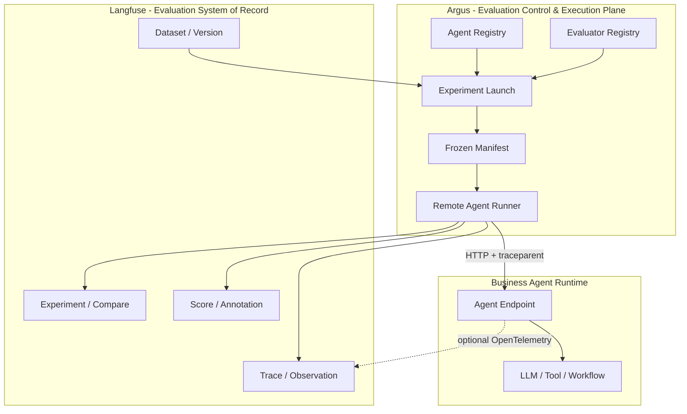

# Argus

> **企业级 AI Agent 低侵入评测与质量门禁平台**
>
> 将 Agent 评测从“每个应用仓库里的测试脚本”升级为统一、可复现、可治理的平台能力。

Argus 面向企业内部多团队、多语言、多 Agent Framework 的统一评测场景。项目基于 Langfuse 已有的 Dataset、Trace、Observation、Experiment 和 Score 能力，补齐 **Agent Registry、版本化评测、远程执行、企业治理与 Release Gate** 等执行控制面能力。

Argus 的核心边界是：

```text
Langfuse = Dataset / Trace / Observation / Experiment / Score 的 System of Record
Argus    = Agent Registry / Versioned Launch / Remote Execution / Evaluation Orchestration / Release Gate
Agent    = 正常业务应用，不感知 Evaluation Framework
```

> 当前仓库已经进入 **Platform MVP 持续演进阶段**，不再定位为 PoC 测试工程。仓库中的 Demo Agent、示例 Dataset 和本地 Docker Compose 主要用于开发、回归测试和端到端验证，不代表 Argus 的产品边界。

---

## 1. 为什么需要 Argus

传统 Agent 评测通常把 Dataset Runner、Evaluator、Judge 配置和 CI 逻辑放进每个 Agent 仓库：

```text
Agent Repo
├── production code
├── eval.py / Eval SDK
├── dataset loader
├── judge config
└── CI evaluation logic
```

当 Agent 数量、团队数量和技术栈增长后，这种方式会带来：

- 评测 SDK 和业务代码强耦合；
- timeout、retry、并发、rate limit 等执行逻辑重复建设；
- Dataset、Evaluator、Baseline 和 Score 缺乏统一版本治理；
- 测试调用路径可能偏离真实生产 API；
- Java、Python、Node 以及不同 Agent Framework 需要分别适配；
- 很难形成统一、可审计的发布质量门禁。

Argus 将这些能力上移到统一的平台控制面：

```text
Dataset
   │
   ▼
Experiment Launch
   │
   ├─ freeze Dataset Version
   ├─ freeze Agent Version
   ├─ freeze Evaluator Version
   └─ freeze Runner Version
   │
   ▼
Remote Agent Runner ── W3C Trace Context ──► Business Agent
   │
   ├─ Retry / Timeout / Rate Limit
   ├─ Item Execution / Attempt
   ├─ Evaluation
   └─ Langfuse Trace / Score / Experiment
```

---

## 2. 核心设计原则

### 2.1 业务 Agent 零 Evaluation SDK 侵入

被测 Agent 只需要提供正常业务 API，例如：

```http
POST /api/v1/invoke
Content-Type: application/json
```

Agent 不需要：

- 引入 Langfuse Evaluation SDK；
- 引入 Argus Evaluation SDK；
- 读取 Dataset；
- 自己运行 Evaluator；
- 为“当前正在评测”增加业务分支。

如果 Agent 已经使用 OpenTelemetry，可以通过标准 W3C `traceparent` 将内部 LLM / Tool Span 与评测 Trace 关联；这属于可观测性增强，而不是运行基础评测的前置条件。

### 2.2 Langfuse 与 Argus 职责分离

Argus 不重复实现 Langfuse 已经成熟的数据模型和分析 UI。

- **Langfuse**：Dataset、Trace、Observation、Experiment、Score、Compare、Annotation。
- **Argus**：Agent Registry、版本快照、远程执行、状态机、企业策略与发布门禁。

### 2.3 评测必须可复现

正式评测必须能够确定至少四个版本：

```text
Dataset Version
Agent Version
Evaluator Version
Runner Version
```

Argus 在创建 Experiment Launch 时生成冻结 Manifest，避免运行过程中因“latest”漂移而失去复现能力。

### 2.4 Evaluation Context 不污染业务 DTO

评测上下文优先通过标准 Trace Context 和 HTTP Header 传递：

```http
traceparent: ...
X-Eval-Launch-Id: ...
X-Eval-Dataset-Item-Id: ...
X-Eval-Agent-Version: ...
```

Dataset 到 Agent 请求体的转换由 AgentVersion 中的 Request Mapping 定义。

---

## 3. 当前已实现能力

截至当前 `main`，Argus 已具备 Platform MVP 的第一阶段核心能力：

### Agent Registry

- PostgreSQL 持久化的 `AgentDefinition` / `AgentVersion`；
- 同一 Agent 支持多个不可变版本；
- AgentVersion 可独立定义 Endpoint、Protocol、Request Mapping、Schema 和 Execution Policy；
- 支持版本归档；
- Credential 仅保存 `credentialRef`，不在 Registry 中保存明文 Secret；
- 对不受支持的 Credential Reference 采用显式拒绝策略。

### Versioned Experiment Launch

- 持久化 `ExperimentLaunch`；
- Dataset / Agent / Evaluator / Runner 四维冻结 Manifest；
- Dataset 版本与内容快照校验；
- Evaluator Registry 与 Evaluator Snapshot；
- Idempotency-Key 与冲突检测；
- Launch 生命周期持久化；
- Item Execution 与 Execution Attempt 持久化；
- execution failure 与 evaluation failure 分离；
- 质量结论采用 fail-closed / unknown-safe 语义，避免无 Evaluator 时产生误判。

### Remote Evaluation Runner

- `SYNC_HTTP` Remote Agent 调用；
- Request Mapping；
- timeout / retry / rate limit；
- AgentVersion 并发策略继承；
- W3C Trace Context 注入；
- 每次 Attempt 的 HTTP 状态、错误、延迟与 Trace 接收状态记录；
- deterministic item-level Evaluator；
- Langfuse Experiment / Trace / Observation / Score 集成。

### 工程质量

- Ruff 代码质量检查；
- Python 全量测试与 branch coverage；
- Docker / Compose 校验；
- Langfuse Cloud E2E；
- OpenAPI 快照与 drift check；
- CI Artifact 保留失败现场和 E2E 结果。

---

## 4. 当前阶段与 Roadmap

Argus 正在按企业级平台路线持续演进：

| 阶段 | 主题 | 状态 |
|---|---|---|
| S1 | Agent Registry 与版本化评测领域模型 | ✅ 已完成 |
| S1.5 | 官方 Langfuse + 独立 i18n Patch Layer | ✅ 已完成 |
| S2 | 异步 Orchestrator、Queue / Worker、可靠执行状态机 | 🚧 Roadmap |
| S3 | 版本化评测、Baseline Comparison、Run-level Score | 🚧 Roadmap |
| S4 | Standard Agent Trajectory、Trace Assembler、深度轨迹评测 | 🚧 Roadmap |
| S5 | Vault、RBAC、SSO、Audit、数据脱敏 | 🚧 Roadmap |
| S6 | ReleasePolicy、Release Gate、CLI、CI/CD 集成 | 🚧 Roadmap |

目标里程碑：

- **v0.2 Platform MVP**：支持内部多 Agent 团队试点；
- **v1.0 Enterprise Agent Evaluation Platform**：形成企业统一 Agent 质量基础设施。

详细计划见 [Roadmap Issue #1](https://github.com/miniceM/Argus/issues/1)。

---

## 5. 总体架构



逻辑上分为三层：

1. **评测资产与结果层**：Langfuse；
2. **评测控制与远程执行层**：Argus；
3. **业务 Agent Runtime**：现有业务服务，无评测框架侵入。

---

## 6. 核心领域模型

### AgentDefinition

描述一个可被 Argus 管理和评测的 Agent。

### AgentVersion

描述某个不可变、可执行的 Agent 版本，包括：

- Endpoint / Protocol；
- Request / Response Schema；
- Request Mapping；
- Execution Policy；
- Credential Reference；
- Artifact / Environment Metadata；
- Trace Propagation 配置。

### ExperimentLaunch

描述一次可审计评测请求，并冻结：

- Dataset；
- AgentVersion；
- Evaluator；
- Runner；
- 执行策略与 Idempotency 信息。

### ExperimentItemExecution / ExecutionAttempt

将单个 Dataset Item 的逻辑执行与技术重试分离：

```text
ExperimentLaunch
└─ ExperimentItemExecution
   ├─ Attempt #1
   ├─ Attempt #2
   └─ Final Attempt
```

这样 Retry 不会被错误地统计成多个独立测试样本。

---

## 7. 快速开始

### 环境要求

- Docker Engine / Docker Desktop
- Docker Compose v2
- 建议至少 8 GB 可用内存
- Python 3
- `curl`

### 本地开发与端到端演示

仓库保留了一套自包含的本地环境，用于开发和回归验证：

```bash
make validate
make up
make ps
make demo
```

服务地址：

- Argus Eval Runner: `http://localhost:18080`
- FastAPI / OpenAPI Docs: `http://localhost:18080/docs`
- Langfuse: `http://localhost:3000`

停止环境：

```bash
make down
```

清理本地 Volume：

```bash
make clean
```

> `.env.poc`、Demo Agent v1/v2 和示例 Dataset 只用于本地开发与 E2E。生产部署必须替换演示凭据，并按企业安全要求接入 Secret Manager、网络隔离、身份认证和审计能力。

Langfuse Web 使用独立的 `zh-CN` Patch Layer 镜像。补丁只覆盖界面渲染、导航和语言切换，不改变 Dataset、Trace、Observation、Experiment、Score 或业务 API 契约。构建与部署说明见 [`deploy/langfuse/README.md`](./deploy/langfuse/README.md)。

---

## 8. 核心 API

Argus 当前提供版本化平台 API：

### Agent Registry

```text
POST /api/v1/agents
GET  /api/v1/agents?id=...

POST /api/v1/agent-versions
GET  /api/v1/agent-versions?agent_id=...&version=...
POST /api/v1/agent-versions/archive
```

### Experiment Launch

```text
POST /api/v1/experiment-launches
GET  /api/v1/experiment-launches?id=...

GET  /api/v1/experiment-launch-items?launch_id=...
GET  /api/v1/execution-attempts?item_execution_id=...
```

完整 API 合约见：

- [docs/openapi.json](./docs/openapi.json)
- 启动服务后的 `/docs`

仓库仍保留 `/experiments/run` 等兼容/演示接口，用于现有 E2E 和迁移验证；新平台能力应优先使用 `/api/v1/*`。

---

## 9. Demo Regression

Demo Agent v1/v2 是一组固定的回归样例，用来验证 Argus 的远程评测链路，而不是项目本身的产品定位。

示例 Dataset 包含 6 个金融场景，覆盖：

- 意图识别；
- Tool 选择；
- 敏感信息保护；
- 高风险场景升级人工；
- 普通账户查询；
- 卡片被盗冻结。

当前固定回归基线：

```text
Agent v1: overall_pass = 2 / 6
Agent v2: overall_pass = 6 / 6
```

该基线由自动化测试和 Langfuse Cloud E2E 保护，用于检测 Runner、Evaluator、Trace、Dataset 与基础设施回归。

---

## 10. CI 与质量门禁

仓库使用 `.github/workflows/ci.yml` 作为统一质量门禁：

```text
Code Quality
    +
Full Python Tests
    +
Docker / Compose Validation
    ↓
Langfuse Cloud E2E
```

建议 `main` Branch Protection 要求以下检查通过：

- `Code Quality`
- `Full Python Tests`
- `Docker / Compose Validation`
- `Langfuse Cloud E2E`

`.github/workflows/langfuse-i18n.yml` 只在 `deploy/langfuse/**` 或该工作流自身发生变化时执行；也可以通过 `workflow_dispatch` 手动执行。Pull Request 会验证补丁、资源、类型检查、UI 测试并构建镜像，但不会推送 GHCR。合并到 `main` 后，工作流会将成品推送到 `ghcr.io/minicem/argus-langfuse-i18n`，并生成不可变的 `4.38.0-i18n-<git-sha>` 标签。

Cloud E2E 建议使用独立 Langfuse CI Project，并通过 GitHub Environment 管理：

- `LANGFUSE_BASE_URL`
- `LANGFUSE_PUBLIC_KEY`
- `LANGFUSE_SECRET_KEY`

Repository Variable：

```text
LANGFUSE_E2E_ENABLED=true
```

外部 fork PR 默认不应获得 Langfuse Secret。

远程自托管验收固定使用完整 GHCR digest 和构建标识，避免只校验 URL 或漂移的 tag：

```text
LANGFUSE_I18N_IMAGE_DIGEST=ghcr.io/minicem/argus-langfuse-i18n@sha256:<registry-digest>
LANGFUSE_I18N_BUILD_ID=argus-i18n-<git-sha>
```

验收脚本会读取 registry OCI config、检查运行中服务的 `/api/public/argus-image-identity`，并确认两者与预期 build ID 一致。私有 GHCR package 还需提供具备 `read:packages` 权限的 `LANGFUSE_GHCR_USERNAME` 和 `LANGFUSE_GHCR_TOKEN`；公开 package 可匿名查询。

---

## 11. 仓库结构

```text
.
├── Agents.md                     # AI / Coding Agent 工程规范
├── README.md
├── TECHNICAL_DESIGN.md           # 总体技术设计基线
├── docker-compose.yml            # 本地 Langfuse + Argus + Demo 环境
├── docker-compose.cloud.yml      # Langfuse Cloud E2E / 开发模式
├── docs/
│   └── openapi.json              # API 合约快照
├── migrations/                   # Argus PostgreSQL Schema 迁移
├── config/
│   └── agents.yaml               # Demo / Bootstrap Registry 配置
├── data/
│   └── dataset.json              # Demo Regression Dataset
├── services/
│   ├── demo-agent/               # 无 Evaluation SDK 的业务 Agent 样例
│   └── eval-runner/
│       └── app/
│           ├── api_registry.py
│           ├── api_launches.py
│           ├── registry.py
│           ├── manifest.py
│           ├── db.py
│           ├── db_models.py
│           ├── executor.py
│           ├── dataset.py
│           ├── evaluators.py
│           └── security.py
├── scripts/
└── tests/
```

---

## 12. 当前边界

当前 `main` 已经完成持久化 Registry 与版本化 Launch，但仍不是完整的 v1.0 企业平台。

尚在 Roadmap 中的关键能力包括：

- durable async Orchestrator / Queue / Worker；
- Cancel / Resume / failed-only rerun；
- Baseline vs Candidate 自动比较；
- LLM-as-a-Judge 的完整版本治理；
- Standard Agent Trajectory 与 Trace Assembler；
- Vault / KMS / Secret Manager 正式集成；
- SSO / RBAC / Audit；
- Dataset 审批与数据脱敏；
- ReleasePolicy / Release Gate；
- CLI 与 CI/CD 发布门禁集成；
- 多租户配额、SLO 与平台运营能力。

这些能力应在不破坏“业务 Agent 零 Evaluation SDK 侵入”和“Langfuse 作为评测数据 System of Record”两个核心边界的前提下持续演进。

---

## 13. 设计与开发规范

详细架构设计见：

- [TECHNICAL_DESIGN.md](./TECHNICAL_DESIGN.md)

仓库内 AI Agent / Coding Agent 的开发规范见：

- [Agents.md](./Agents.md)

所有重要功能开发、Bug 修复和重构应遵循：

```text
Issue / Design
    ↓
RED
    ↓
GREEN
    ↓
REFACTOR
    ↓
Target Tests
    ↓
make validate
    ↓
CI / E2E
```

---

## 14. 项目目标

Argus 的最终目标不是“生成一次评测报告”，而是把 Agent 质量保障变成企业软件工程基础设施：

```text
Production Observability
        ↓
Failure Mining
        ↓
Dataset Curation
        ↓
Offline Regression
        ↓
Release Gate
        ↓
Production Monitoring
        ↺
```

让不同团队、不同语言、不同 Agent Framework 共享同一套 Dataset、Evaluator、版本治理、回归评测、审计与发布标准，并让业务 Agent 始终保持对评测框架的低侵入甚至零侵入。
