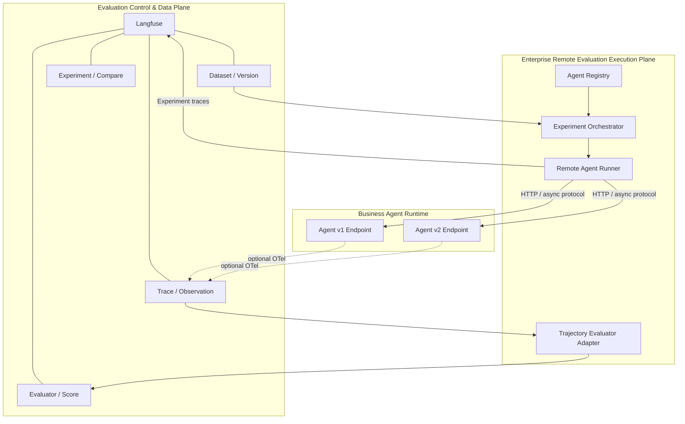
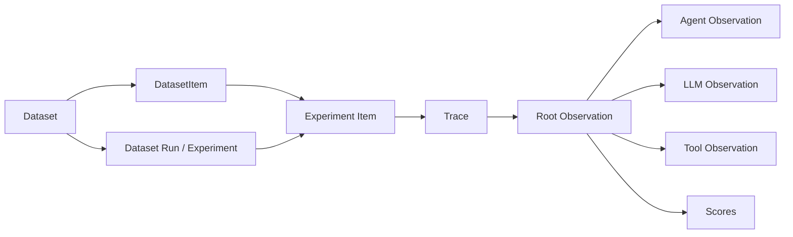
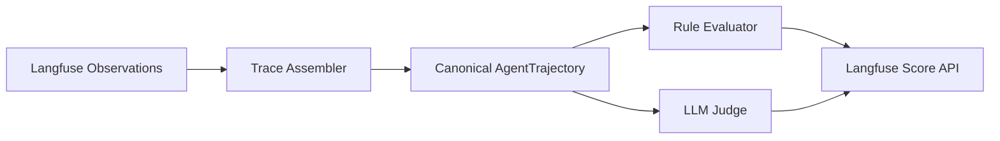
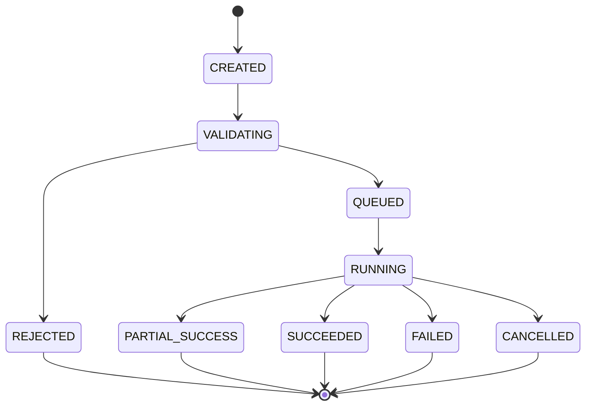
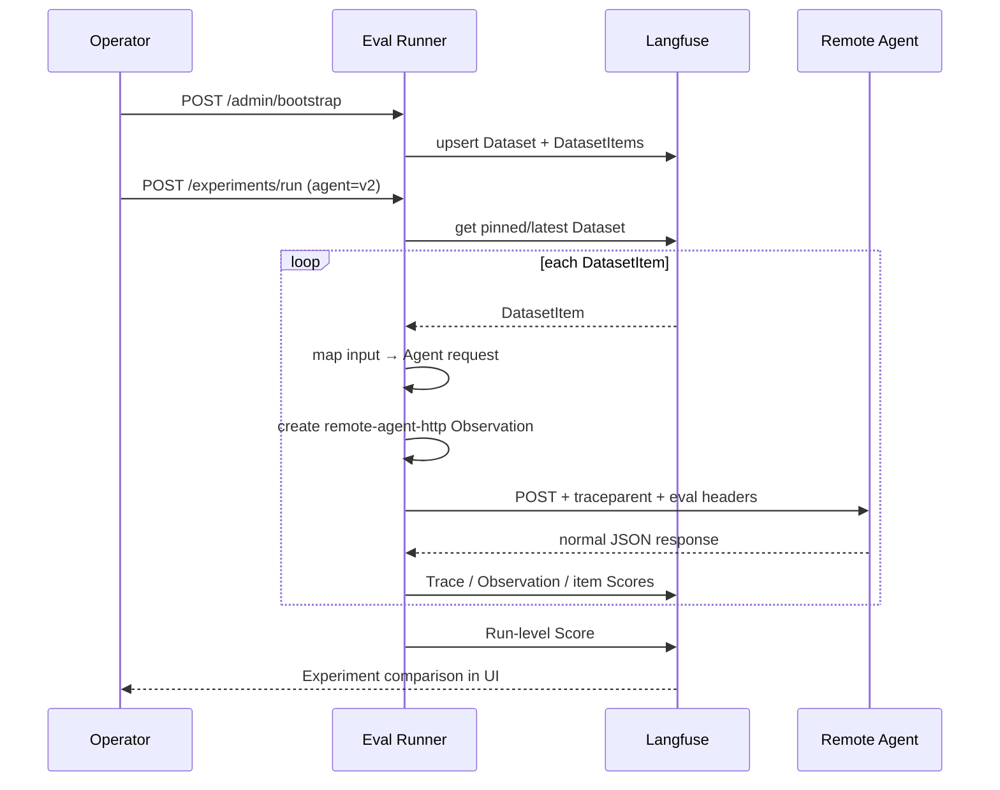

# 企业级 AI Agent 评测平台技术设计

**文档版本：** 1.0  
**状态：** PoC 技术基线 / 待架构评审  
**日期：** 2026-09-16  
**方案：** Langfuse Evaluation System of Record + Enterprise Remote Agent Eval Runner

---

## 1. 文档目的

本文定义一套面向企业、多团队、多语言、多 Agent Framework 的统一 Agent 评测平台技术方案。核心目标不是再造一套 Trace/Dataset/Evaluator 产品，而是在 Langfuse 已有评测数据能力之上补齐一个企业级 **Remote Agent Execution Plane**，使应用团队无需在业务 Agent 中引入 Evaluation SDK 或维护独立 Eval Harness。

本设计同时给出一个可运行 PoC：

```text
Langfuse + Eval Runner + Demo Agent v1/v2
```

PoC 用于验证最关键的架构假设：

> **Agent 团队只提供正常业务 API；评测 Dataset、执行编排、Evaluator、版本比较和发布判断属于平台能力。**

---

## 2. 背景与问题定义

传统 Agent 评测常采用如下模式：

```text
Agent Repo
├── production code
├── eval.py / Eval()
├── dataset loader
├── judge config
└── CI evaluation logic
```

这种模式在单项目中可工作，但进入大型企业后会产生系统性问题：

1. **侵入业务代码。** 每个团队都要理解和接入某个 Eval SDK。
2. **执行逻辑分散。** timeout、retry、并发、rate limit、版本标记等在各仓库重复建设。
3. **评测资产无法集中治理。** Dataset、Judge、基线版本和 Score 缺少统一生命周期。
4. **测试路径可能偏离生产路径。** Eval task function 容易与真实 Agent API 的调用方式产生差异。
5. **多语言/多框架成本高。** Java、Python、Node、AgentScope、Spring AI、LangGraph 等需要各自适配。
6. **难以形成统一发布门禁。** “这个 Agent 新版本能不能上线”无法形成平台层可审计判断。

本方案将评测职责从 Agent Repo 上移到企业评测控制面。

---

## 3. 设计目标

### 3.1 核心目标

- Agent 应用**零 Evaluation SDK 侵入**；
- Dataset 能由人工录入、文件导入或生产 Trace 沉淀；
- 平台能够选择 Agent Version，对固定 Dataset 进行远程回放；
- Dataset / Agent / Evaluator / Runner 版本可以锁定和复现；
- 支持 final output、tool usage、trajectory、安全策略等多层评估；
- 评测结果统一进入 Langfuse Experiment / Trace / Observation / Score；
- 新旧版本可以逐 Case 和聚合比较；
- 最终支持 CI/CD Release Gate；
- 兼容企业内部网络、密钥、审计、RBAC 和数据安全要求。

### 3.2 非目标

第一阶段不尝试：

- 用 Eval Runner 取代 Agent Runtime；
- 强制所有 Agent 使用某一 Framework；
- 自研一套 Trace Storage；
- 自研 Dataset UI；
- 自研通用 LLM Observability Backend；
- 把 Langfuse Fork 成企业内部长期维护分支。

---

## 4. 架构原则

### P1. Evaluation Instrumentation = 0

业务 Agent 不需要：

```text
Langfuse Evaluation SDK
@Eval
DatasetRunner
Evaluator callback
Experiment API
```

Agent 只需要正常业务入口，例如：

```http
POST /api/v1/invoke
Content-Type: application/json
```

### P2. Observability 与 Evaluation 分离

如果 Agent 已有 OpenTelemetry，它可以接受 `traceparent`，从而把内部 LLM/Tool Span 关联到评测 Trace；如果 Agent 没有任何 Observability，平台仍然可以进行输入/最终输出级评测。

因此：

```text
Evaluation dependency = 0
Observability dependency = optional enhancement
```

### P3. Langfuse 是 System of Record

Langfuse 负责保存：

- Dataset / DatasetItem / Dataset Version；
- Trace / Observation；
- Experiment / ExperimentItem；
- Evaluator 结果 / Score；
- 人工 Review 与后续分析。

Eval Runner 不建设第二套重复的数据事实源。

### P4. Runner 是无状态/可横向扩展执行平面

生产版本 Runner 的持久状态进入专门的 Orchestrator Store / Queue；Runner worker 本身尽可能无状态，以便 Kubernetes 扩容。

### P5. Evaluation Context 不污染业务 Payload

评测元数据优先放入标准 Trace Context 和 HTTP Header，而不是强制修改 Agent DTO：

```http
traceparent: ...
baggage: ...
X-Eval-Launch-Id: ...
X-Eval-Dataset-Item-Id: ...
X-Eval-Agent-Version: ...
```

---

## 5. 总体架构



逻辑上分为三层：

1. **评测资产与结果层**：Langfuse；
2. **远程执行层**：企业自建 Eval Runner；
3. **业务 Agent 层**：现有 Agent 服务，无评测侵入。

---

## 6. 为什么采用 Langfuse + Remote Runner

Langfuse 当前已经解决大量高成本公共能力：

- Trace / Observation；
- Dataset / DatasetItem / Version；
- Production Trace → Dataset；
- Experiment；
- Item-level / Run-level Evaluator；
- Score；
- Experiment Comparison；
- Annotation / Review；
- OpenTelemetry-based tracing；
- Self-hosting。

缺口主要集中在：

- Agent Registry；
- Endpoint Contract；
- Dataset Row → HTTP Request Mapping；
- 平台托管的 Remote Agent fan-out；
- 企业级 retry / timeout / rate limit；
- Async Agent；
- Trajectory Evaluation；
- Release Gate。

因此合理策略是**补执行面而不是复制数据面**。

---

## 7. Langfuse 数据模型映射

Langfuse v4 采用 Observation-first / OpenTelemetry 模型。平台侧建议按下列关系理解：



### 7.1 DatasetItem

DatasetItem 是“测试规范”，不应该存 Candidate Version 的运行结果。

推荐结构：

```json
{
  "input": {
    "messages": [{"role":"user","content":"查询异常交易"}],
    "customer_id": "C10001"
  },
  "expected_output": {
    "intent": "transaction_investigation",
    "required_tool": "transaction-query",
    "forbidden_fields": ["full_account_number"],
    "must_escalate": false
  },
  "metadata": {
    "domain": "banking",
    "risk_level": "medium"
  }
}
```

Candidate 的 output 属于 ExperimentItem / Trace。

### 7.2 一个 DatasetItem 一条 Trace

推荐：

```text
DatasetItem #123
  └─ ExperimentItem
      └─ Trace #abc
          ├─ Root experiment task
          ├─ remote-agent-http
          ├─ Agent/LLM/Tool spans (optional)
          └─ Scores
```

不建议将整个 Dataset Run 放在一条超大 Trace 中。

---

## 8. 企业扩展领域模型

Langfuse 原生对象不需要复制。企业侧只新增少量对象。

### 8.1 AgentDefinition

描述“一个可以被评测的平台 Agent”。

```json
{
  "id": "banking-agent",
  "name": "银行客服 Agent",
  "owner": "retail-banking-ai",
  "protocol": "HTTP_JSON",
  "risk_level": "high"
}
```

### 8.2 AgentVersion

描述“某一个可执行版本”。

```json
{
  "agent_id": "banking-agent",
  "version": "2.7.0",
  "endpoint": "http://banking-agent-v2.svc/api/v1/invoke",
  "auth_ref": "vault://agent-eval/banking-agent",
  "request_schema": {},
  "response_schema": {},
  "request_mapping": {
    "messages": "input.messages",
    "customer_id": "input.customer_id"
  },
  "execution_policy": {
    "timeout_ms": 120000,
    "max_concurrency": 20,
    "rate_limit_per_minute": 120,
    "max_retries": 2
  }
}
```

### 8.3 ExperimentLaunch

表示“用户希望平台按什么配置执行一次评测”，与最终 Langfuse Experiment 结果区分。

```json
{
  "launch_id": "...",
  "dataset": {"id":"...", "version":"..."},
  "target": {"agent_id":"banking-agent", "agent_version":"2.7.0"},
  "evaluators": ["correctness:v5", "policy:v12", "trajectory:v3"],
  "baseline_experiment_id": "...",
  "runner_version": "1.3.2",
  "execution_policy": {"max_concurrency":20, "timeout_ms":120000}
}
```

### 8.4 ExperimentItemExecution

表示单个 Dataset Item 的执行状态：

```text
PENDING
  ↓
QUEUED
  ↓
RUNNING
  ├─ SUCCEEDED
  ├─ FAILED
  ├─ TIMED_OUT
  └─ CANCELLED
```

其下可包含多个 `ExecutionAttempt`。

---

## 9. 版本治理

一次可审计评测至少锁定：

```text
datasetVersion
agentVersion
evaluatorVersion
runnerVersion
```

进一步建议记录：

```text
requestSchemaVersion
policyVersion
judgeModel
judgePromptVersion
gitCommit
containerImageDigest
```

不能只保存一个“最终分数”，否则分数无法复现。

### 9.1 Dataset Version

- 正式 Release Evaluation 必须 pin Dataset Version；
- Dataset 改动应产生新版本；
- Critical / Golden Case 需要审批；
- Production failure 可以持续进入候选数据池，但不能静默改变已批准 Release Baseline。

### 9.2 Baseline

Baseline 应为显式批准的 Experiment，而不是自动指向“最近一次成功运行”。

---

## 10. Remote Agent 调用协议

### 10.1 SYNC_HTTP

PoC 实现：

```http
POST {agent.endpoint}
Content-Type: application/json
traceparent: 00-...
X-Eval-Launch-Id: ...
X-Eval-Dataset-Item-Id: ...
X-Eval-Agent-Version: ...

{mapped dataset input}
```

返回：

```http
200 OK
Content-Type: application/json

{agent result}
```

约束：

- Request / Response 必须符合注册 Schema；
- 业务 Payload 不强制包含平台 metadata；
- Runner 负责 timeout / retry / rate limit；
- Runner 记录 HTTP 状态、attempt、duration。

### 10.2 未来异步协议

企业 Agent 不应被限制在 300 秒同步请求。

推荐预留：

```text
SYNC_HTTP
ASYNC_POLL
CALLBACK
SSE
```

`ASYNC_POLL` 示例：

```json
{
  "invocation_mode": "ASYNC_POLL",
  "submit_endpoint": "/runs",
  "status_endpoint": "/runs/{runId}",
  "result_endpoint": "/runs/{runId}/result"
}
```

这适合 Research/Coding/Workflow Agent。

---

## 11. Request Mapping

Dataset schema 与业务 Agent API 不应强绑定。

平台提供 mapping：

```yaml
request_mapping:
  messages: input.messages
  customer_id: input.customer_id
```

未来可扩展：

- JSONPath/JMESPath；
- 模板常量；
- Header mapping；
- Secret injection；
- Environment overrides；
- Preprocessor plug-in。

Mapping 是 AgentVersion 的一部分，必须版本化。

---

## 12. W3C Trace Context

Runner 在一个 DatasetItem 的 Experiment Task 中创建远程调用 Observation，然后注入当前 OpenTelemetry Context：

```python
with langfuse.start_as_current_observation(...):
    inject(headers)
    await http_client.post(agent_url, headers=headers)
```

产生：

```text
Experiment Item Trace
└─ remote-agent-http
   └─ downstream Agent spans (if the Agent consumes W3C context)
      ├─ router
      ├─ LLM
      └─ tool
```

### 12.1 安全原则

- 不从不可信公网请求直接接受并信任 arbitrary baggage；
- 只传播必要的非敏感标识；
- 业务身份与 Trace identity 分离；
- 对跨安全域传播设置 Gateway allowlist。

---

## 13. Evaluator 设计

评测能力分四层。

### L1. Deterministic Evaluator

适合：

- JSON Schema；
- exact match；
- 必须/禁止 Tool；
- 参数约束；
- PII 字段；
- latency / token / cost threshold。

PoC 实现：

```text
intent_match
required_tool_match
pii_safe
escalation_match
overall_pass
overall_pass_rate
```

### L2. LLM-as-a-Judge

适合：

- 正确性；
- 完整性；
- 语义一致性；
- 专业性；
- 政策遵循。

生产要求：

- Judge Model 固定；
- Judge Prompt 版本化；
- 使用 human-labelled calibration set；
- 记录方差和置信区间；
- Critical Gate 不只依赖单一 Judge。

### L3. Human Review

高风险金融场景需要业务专家复核：

```text
自动评测低置信度/冲突
        ↓
Annotation Queue
        ↓
Human Decision
        ↓
Dataset / Evaluator calibration
```

### L4. Trajectory Evaluation

复杂 Agent 需要评价过程而不是只评价答案：

- 工具选择是否正确；
- Tool 参数是否正确；
- 调用顺序是否合理；
- 是否出现循环；
- 是否有无效/多余 Tool；
- 是否满足关键步骤；
- 是否绕过合规流程。

---

## 14. Trajectory Evaluator Adapter

Langfuse v4 是 Observation-first，因此建议自建一层 Trace Assembler，而不是创建第二套 Trace Backend。



Canonical trajectory：

```json
{
  "input": {},
  "steps": [
    {"type":"LLM","name":"router"},
    {"type":"TOOL","name":"customer-query","arguments":{}},
    {"type":"TOOL","name":"transaction-query","arguments":{}}
  ],
  "output": {}
}
```

这样可以屏蔽 LangGraph / AgentScope / Spring AI / OpenAI Agents SDK 等底层 Framework 差异。

---

## 15. Retry、Trial 与幂等

### 15.1 Retry

Retry 是同一次 Dataset Item 执行过程中的技术重试：

```text
ExperimentItem
└─ Execution
   ├─ Attempt #1: 503
   ├─ Attempt #2: timeout
   └─ Attempt #3: 200
```

不应该生成 3 个独立测试样本。

### 15.2 Trial

Trial 是为了测 Agent 非确定性而主动重复业务执行：

```text
Case A × 5 trials
```

Trial 必须进入统计模型，例如：

- pass probability；
- score variance；
- trajectory variance；
- worst-case failure。

不要把 Trial 和 Retry 混用。

### 15.3 Idempotency

生产 API 需要支持：

```text
Idempotency-Key = launchId + datasetItemId + trialIndex
```

对于有副作用的 Agent，必须提供 Evaluation/Sandbox 环境或者 mock/dry-run 工具，否则回放历史 Dataset 可能造成真实交易或通知。

---

## 16. Runner 状态机

生产 Orchestrator 推荐状态：



单 Item 状态单独维护，以支持大规模 Dataset、暂停/恢复和 failed-only rerun。

---

## 17. PoC API

### `GET /health`

Runner 健康状态。

### `GET /agents`

显示注册的 Agent / Version。

### `POST /admin/bootstrap`

将演示 Dataset 幂等写入 Langfuse。

### `POST /experiments/run`

请求：

```json
{
  "agent_id": "banking-agent",
  "agent_version": "v2",
  "dataset_name": "banking-agent-regression",
  "experiment_name": "banking-agent-v2",
  "max_concurrency": 4
}
```

生产版 API 应返回 `202 Accepted + launchId`，由异步 Orchestrator 执行；PoC 为便于演示采用同步等待。

---

## 18. 安全设计

### 18.1 网络

推荐生产拓扑：

```text
Langfuse / Eval Control Plane
         │
Internal Eval Runner on Kubernetes
         │  mTLS / Service Mesh
         ▼
Internal Agent Services
```

Agent Endpoint 不要求暴露公网。

### 18.2 Secrets

PoC 仅使用 `.env.poc`。

生产禁止在 Agent Registry 保存 Secret 明文，只保存：

```text
vault://...
aws-secrets-manager://...
azure-keyvault://...
gcp-secret-manager://...
```

Runner 在执行时按最小权限读取。

### 18.3 RBAC

至少区分：

- Dataset Viewer / Editor / Approver；
- Evaluator Author / Approver；
- Agent Owner；
- Experiment Operator；
- Release Approver；
- Platform Admin。

### 18.4 数据保护

- Dataset 入库前 PII classification；
- Production Trace → Dataset 时支持 masking/redaction；
- Judge provider 必须符合数据跨境和敏感数据政策；
- Critical Dataset 的导出与修改进入审计。

---

## 19. Release Gate

最终目标不是“生成一张评测报表”，而是形成软件发布质量门禁。

示例规则：

```yaml
release_gate:
  aggregate:
    overall_pass_rate: ">= 0.95"
    pii_safe: "== 1.0"
  critical_cases:
    new_failures: "== 0"
  regression:
    vs_approved_baseline: ">= -0.01"
  operational:
    p95_latency_ms: "<= 12000"
```

Release Gate 必须同时考虑：

- aggregate score；
- critical slices；
- newly failing cases；
- incomplete/error cases；
- latency / cost；
- Judge uncertainty。

不能仅比较平均分。

---

## 20. 可观测性

需要同时观察“被测 Agent”与“评测平台自己”。

### 20.1 Eval Runner Metrics

- launch queue depth；
- active items；
- item throughput；
- retry rate；
- timeout rate；
- agent endpoint 429/5xx；
- score latency；
- dataset items processed；
- experiment completion time。

### 20.2 Logs

每条日志至少包含：

```text
launch_id
experiment_id
dataset_item_id
agent_id
agent_version
attempt
trace_id
```

### 20.3 Distributed Trace

评测 Trace 可以贯穿：

```text
Runner → API Gateway → Agent → LLM → Tool
```

但安全域之间需要明确信任边界。

---

## 21. 扩展性设计

PoC：

```text
FastAPI Runner
└─ in-process concurrency
```

生产：

```text
API / Control Service
       │
       ▼
Persistent Queue
       │
       ├─ Runner Worker Pool
       ├─ Runner Worker Pool
       └─ Runner Worker Pool
             │
             ▼
       Agent Endpoints
```

建议能力：

- queue partition by agent/team；
- tenant quotas；
- per-endpoint concurrency semaphore；
- distributed rate limiter；
- backpressure；
- cancellation；
- checkpoint；
- failed-only rerun。

---

## 22. PoC 组件说明

### 22.1 Langfuse v4

PoC Docker Compose 采用：

- `argus/langfuse-i18n:4.38.0`（官方源码 + 独立 i18n Patch Layer）
- `docker.langfuse.com/langfuse/langfuse-worker:4.38.0@sha256:8631cf429efc4a2981d4e6ced4c005b9f6f620a4e34625baf60152301ec6d006`
- PostgreSQL 17
- ClickHouse 25.12
- Redis 7
- MinIO

Langfuse 通过 `LANGFUSE_INIT_*` 自动初始化 Org、Project、API Key 和演示管理员。

### 22.2 Eval Runner

职责：

```text
Agent Registry
Dataset bootstrap
Request Mapping
HTTP fan-out
Retry/Timeout/Rate-limit
W3C propagation
Langfuse Experiment Runner
Evaluators
```

### 22.3 Demo Agent v1/v2

同一个 Docker Image，通过 `AGENT_VERSION=v1/v2` 表现两个版本。

它们只使用 FastAPI/Pydantic，不依赖 Langfuse 或 Eval SDK。

v1 故意保留：

- wrong tool；
- PII exposure；
- missing escalation；
- wrong stolen-card flow。

v2 修复上述缺陷。

---

## 23. PoC 端到端流程



---

## 24. PoC 验收标准

### 功能

- [ ] Langfuse 可以启动并自动创建项目；
- [ ] Dataset 6 条数据可在 UI 中看到；
- [ ] 同一 Dataset 可分别执行 Agent v1/v2；
- [ ] Demo Agent 中不存在 Eval SDK；
- [ ] Runner 可以通过 registry 更换 Endpoint，不修改 Agent；
- [ ] 每个 DatasetItem 形成独立 Experiment Trace；
- [ ] `remote-agent-http` Observation 可见；
- [ ] Agent 收到 W3C `traceparent`；
- [ ] deterministic Scores 可见；
- [ ] v1/v2 可在 Langfuse 中比较。

### 预期质量结果

```text
v1: 2/6 overall pass
v2: 6/6 overall pass
```

### 关键架构验收

最重要的验收不是分数，而是：

> **从 v1 切换到 v2 的评测只修改平台注册的 Agent Version/Endpoint；不修改 Agent 的评测代码，因为 Agent 根本没有评测代码。**

---

## 25. PoC 与生产实现差异

| 领域 | PoC | 生产建议 |
|---|---|---|
| Langfuse | Docker Compose | Kubernetes/Managed infra |
| Agent Registry | YAML | DB + UI + approval |
| Secrets | `.env` | Vault/KMS/Secret Manager |
| Orchestration | 同步 API | durable workflow / queue |
| Rate limit | process memory | distributed limiter |
| Retry | 简单 backoff | policy engine + DLQ |
| Agent mode | SYNC_HTTP | sync + async + callback + SSE |
| Evaluator | Python deterministic | centralized evaluator registry |
| Trajectory | 未实现 | Trace Assembler + canonical model |
| Release Gate | 未实现 | CI/CD policy service |
| Auth | PoC credentials | SSO/RBAC/service identity |
| Network | Docker bridge | VPC/K8s/mTLS/service mesh |
| Audit | Langfuse + app logs | enterprise audit trail |

---

## 26. 生产落地阶段

### Phase 0 — PoC

验证：

```text
Dataset → Remote Agent → Experiment → Score → Compare
```

### Phase 1 — MVP

增加：

- Agent Registry service；
- ExperimentLaunch DB；
- persistent worker queue；
- Agent Endpoint auth；
- Dataset version pinning；
- evaluator version metadata；
- Git/CI trigger；
- baseline compare；
- basic Release Gate。

### Phase 2 — Enterprise

增加：

- Async Agent；
- Trajectory Evaluation；
- Human review；
- Vault/mTLS；
- RBAC/approval；
- policy repository；
- data masking；
- SLO/chargeback；
- multi-tenant quota。

### Phase 3 — Continuous Evaluation

形成：

```text
Production Observability
        ↓
Failure Mining
        ↓
Dataset Curation
        ↓
Offline Regression
        ↓
Release Gate
        ↓
Production Monitoring
        ↺
```

---

## 27. 风险与控制

### Judge 不稳定

控制：固定 Judge 版本、校准、multi-judge/规则组合、critical case deterministic gate。

### Dataset Drift

控制：版本化、审批、slice coverage、定期 refresh，不自动覆盖 Approved Baseline。

### Replay 造成业务副作用

控制：Evaluation Environment、sandbox tool、dry-run、幂等、禁止调用真实支付/通知系统。

### Production Data 泄露

控制：Trace-to-Dataset redaction、分类分级、最小化数据、Judge provider policy。

### “零侵入”被误解为“零可观测”

控制：明确 Evaluation SDK = 0；OTel 是独立的可观测性增强，复杂 trajectory eval 才需要内部 Span。

### 依赖 Langfuse 版本演进

控制：不 Fork；API adapter 层；锁定 SDK/镜像；升级回归套件；优先使用 OpenTelemetry 标准。

---

## 28. 技术决策记录

### ADR-001：不 Fork Langfuse

**Decision:** Langfuse 作为上游产品直接部署，企业能力通过独立服务/API 扩展。  
**Reason:** 降低 v4 数据模型快速演进期间的维护成本。

### ADR-002：Agent 无 Evaluation SDK

**Decision:** Evaluation Harness 全部存在于 Runner。  
**Reason:** 降低团队接入门槛并保证生产调用路径一致。

### ADR-003：W3C Trace Context 为跨服务标准

**Decision:** 使用 `traceparent`/OpenTelemetry，不设计厂商私有 Trace Header。  
**Reason:** Framework-neutral、语言无关、可接企业现有 APM。

### ADR-004：Langfuse 是评测数据 System of Record

**Decision:** Runner 不复制 Trace/Dataset/Score 主数据。  
**Reason:** 避免数据双写和一致性治理。

### ADR-005：平台 Header 承载 Evaluation Context

**Decision:** 不默认往业务 JSON 中添加 `_eval_metadata`。  
**Reason:** 避免破坏 Java DTO / JSON Schema / API compatibility。

---

## 29. PoC 运行与验证

```bash
make validate
make up
make demo
```

完整运行说明见 `README.md`。

生成本材料的环境不包含 Docker runtime，因此本次交付完成了配置解析、Python 编译、业务行为测试和代码级架构检查，但未在生成环境内实际启动容器。Docker Compose 文件按 2026-09-16 Langfuse v4 官方 self-host 文档和当前 SDK 方式编制；应在具备 Docker Compose 的目标环境执行上述命令完成最终环境验收。

---

## 30. 官方兼容性依据（截至 2026-09-16）

设计校准于以下 Langfuse 官方文档：

- Self-host Docker Compose v4: `https://langfuse.com/self-hosting/deployment/docker-compose`
- Headless Initialization: `https://langfuse.com/self-hosting/administration/headless-initialization`
- Experiments via SDK: `https://langfuse.com/docs/evaluation/experiments/experiments-via-sdk`
- Datasets: `https://langfuse.com/docs/evaluation/experiments/datasets`
- SDK / OpenTelemetry: `https://langfuse.com/docs/observability/sdk/overview`
- Instrumentation / Observation: `https://langfuse.com/docs/observability/sdk/instrumentation`
- Distributed Tracing: `https://langfuse.com/docs/observability/features/trace-ids-and-distributed-tracing`

生产实施时应以所部署 Langfuse 实例自带的 `/api/docs` / `/api/openapi.yaml` 作为最终 API 合约依据。

---

## 31. 最终结论

该方案的核心并不是“给 Langfuse 加一个 HTTP 调用脚本”，而是建立新的企业能力边界：

```text
Agent 应用 = 负责业务执行
Langfuse = 负责评测资产与结果
Remote Eval Runner = 负责平台化执行
Enterprise Policy = 负责能否发布
```

当这个边界建立后，企业可以让 Java、Python、Node 以及不同 Agent Framework 共享同一套 Dataset、Evaluator、Release Gate 和审计流程，从而把 Agent 质量保障从“各项目自觉执行”升级为“企业平台统一治理”。
