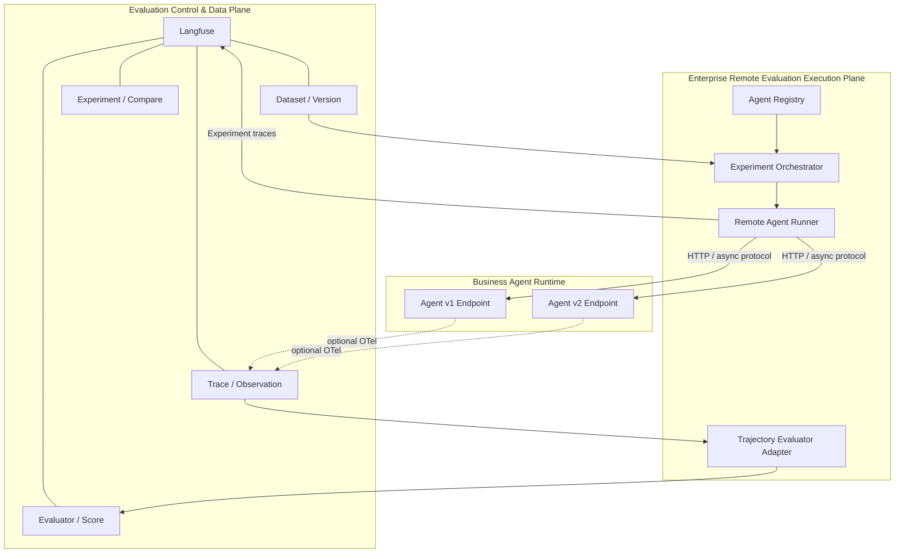
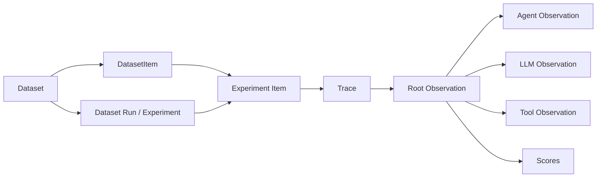
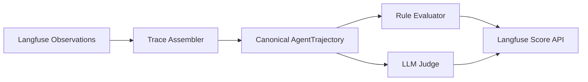
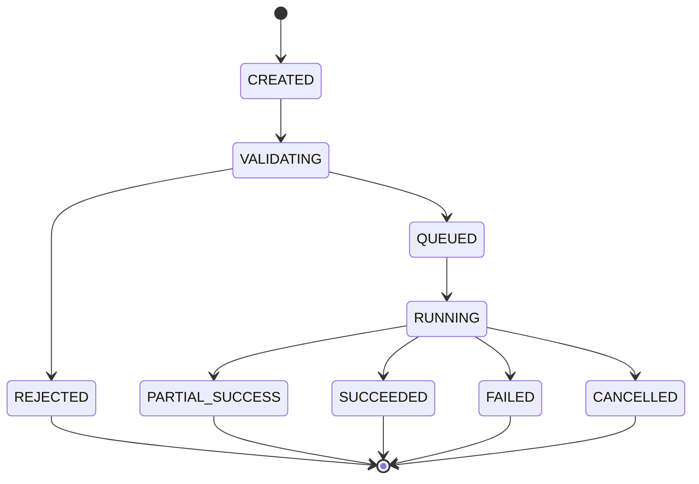
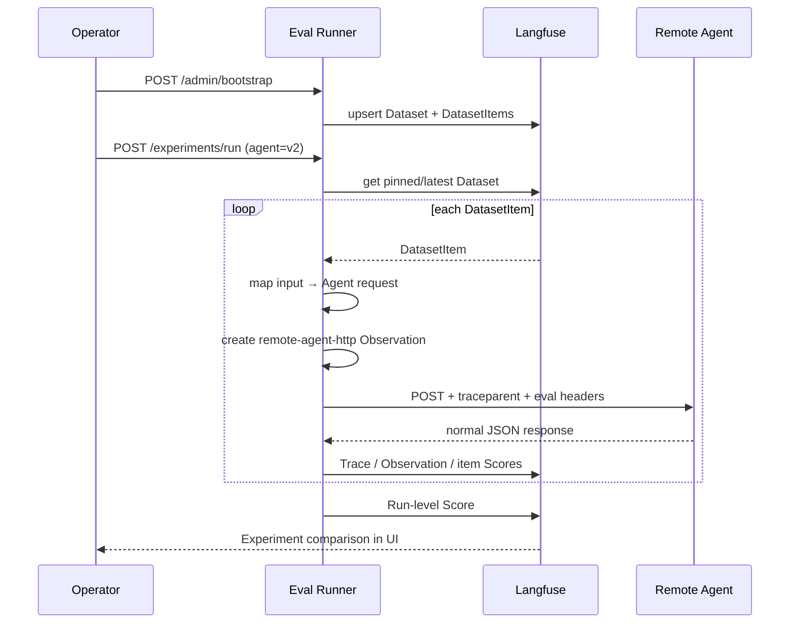

# 企业级 AI Agent 评测平台技术设计

**文档版本：** 1.0  
**状态：** PoC 技术基线 / 待架构评审  
**日期：** 2026-09-16  
**方案：** Langfuse Evaluation System of Record + Enterprise Remote Agent Eval Runner

---

## 1. 文档目的

本文定义一套面向企业、多团队、多语言、多 Agent Framework 的统一 Agent 评测平台技术方案。核心目标不是再造一套 Trace/Dataset/Evaluator 产品，而是在 Langfuse 已有评测数据能力之上补齐一个企业级 **Remote Agent Execution Plane**，使应用团队无需在业务 Agent 中引入 Evaluation SDK 或维护独立 Eval Harness。

本设计同时给出一个可运行 PoC：

```text
Langfuse + Eval Runner + Demo Agent v1/v2
```

PoC 用于验证最关键的架构假设：

> **Agent 团队只提供正常业务 API；评测 Dataset、执行编排、Evaluator、版本比较和发布判断属于平台能力。**

---

## 2. 背景与问题定义

传统 Agent 评测常采用如下模式：

```text
Agent Repo
├── production code
├── eval.py / Eval()
├── dataset loader
├── judge config
└── CI evaluation logic
```

这种模式在单项目中可工作，但进入大型企业后会产生系统性问题：

1. **侵入业务代码。** 每个团队都要理解和接入某个 Eval SDK。
2. **执行逻辑分散。** timeout、retry、并发、rate limit、版本标记等在各仓库重复建设。
3. **评测资产无法集中治理。** Dataset、Judge、基线版本和 Score 缺少统一生命周期。
4. **测试路径可能偏离生产路径。** Eval task function 容易与真实 Agent API 的调用方式产生差异。
5. **多语言/多框架成本高。** Java、Python、Node、AgentScope、Spring AI、LangGraph 等需要各自适配。
6. **难以形成统一发布门禁。** “这个 Agent 新版本能不能上线”无法形成平台层可审计判断。

本方案将评测职责从 Agent Repo 上移到企业评测控制面。

---

## 3. 设计目标

### 3.1 核心目标

- Agent 应用**零 Evaluation SDK 侵入**；
- Dataset 能由人工录入、文件导入或生产 Trace 沉淀；
- 平台能够选择 Agent Version，对固定 Dataset 进行远程回放；
- Dataset / Agent / Evaluator / Runner 版本可以锁定和复现；
- 支持 final output、tool usage、trajectory、安全策略等多层评估；
- 评测结果统一进入 Langfuse Experiment / Trace / Observation / Score；
- 新旧版本可以逐 Case 和聚合比较；
- 最终支持 CI/CD Release Gate；
- 兼容企业内部网络、密钥、审计、RBAC 和数据安全要求。

### 3.2 非目标

第一阶段不尝试：

- 用 Eval Runner 取代 Agent Runtime；
- 强制所有 Agent 使用某一 Framework；
- 自研一套 Trace Storage；
- 自研 Dataset UI；
- 自研通用 LLM Observability Backend；
- 把 Langfuse Fork 成企业内部长期维护分支。

---

## 4. 架构原则

### P1. Evaluation Instrumentation = 0

业务 Agent 不需要：

```text
Langfuse Evaluation SDK
@Eval
DatasetRunner
Evaluator callback
Experiment API
```

Agent 只需要正常业务入口，例如：

```http
POST /api/v1/invoke
Content-Type: application/json
```

### P2. Observability 与 Evaluation 分离

如果 Agent 已有 OpenTelemetry，它可以接受 `traceparent`，从而把内部 LLM/Tool Span 关联到评测 Trace；如果 Agent 没有任何 Observability，平台仍然可以进行输入/最终输出级评测。

因此：

```text
Evaluation dependency = 0
Observability dependency = optional enhancement
```

### P3. Langfuse 是 System of Record

Langfuse 负责保存：

- Dataset / DatasetItem / Dataset Version；
- Trace / Observation；
- Experiment / ExperimentItem；
- Evaluator 结果 / Score；
- 人工 Review 与后续分析。

Eval Runner 不建设第二套重复的数据事实源。

### P4. Runner 是无状态/可横向扩展执行平面

生产版本 Runner 的持久状态进入专门的 Orchestrator Store / Queue；Runner worker 本身尽可能无状态，以便 Kubernetes 扩容。

### P5. Evaluation Context 不污染业务 Payload

评测元数据优先放入标准 Trace Context 和 HTTP Header，而不是强制修改 Agent DTO：

```http
traceparent: ...
baggage: ...
X-Eval-Launch-Id: ...
X-Eval-Dataset-Item-Id: ...
X-Eval-Agent-Version: ...
```

---

## 5. 总体架构


```mermaid
flowchart TB
    subgraph CP[Evaluation Control & Data Plane]
        LF[Langfuse]
        DS[Dataset / Version]
        EV[Evaluator / Score]
        EX[Experiment / Compare]
        TR[Trace / Observation]
        LF --- DS
        LF --- EV
        LF --- EX
        LF --- TR
    end

    subgraph EP[Enterprise Remote Evaluation Execution Plane]
        AR[Agent Registry]
        AO[Experiment Orchestrator]
        RR[Remote Agent Runner]
        TA[Trajectory Evaluator Adapter]
        AR --> AO --> RR
        TA --> EV
    end

    subgraph AG[Business Agent Runtime]
        V1[Agent v1 Endpoint]
        V2[Agent v2 Endpoint]
    end

    DS --> AO
    RR -->|HTTP / async protocol| V1
    RR -->|HTTP / async protocol| V2
    RR -->|Experiment traces| LF
    V1 -. optional OTel .-> TR
    V2 -. optional OTel .-> TR
    TR --> TA
```

逻辑上分为三层：

1. **评测资产与结果层**：Langfuse；
2. **远程执行层**：企业自建 Eval Runner；
3. **业务 Agent 层**：现有 Agent 服务，无评测侵入。

---

## 6. 为什么采用 Langfuse + Remote Runner

Langfuse 当前已经解决大量高成本公共能力：

- Trace / Observation；
- Dataset / DatasetItem / Version；
- Production Trace → Dataset；
- Experiment；
- Item-level / Run-level Evaluator；
- Score；
- Experiment Comparison；
- Annotation / Review；
- OpenTelemetry-based tracing；
- Self-hosting。

缺口主要集中在：

- Agent Registry；
- Endpoint Contract；
- Dataset Row → HTTP Request Mapping；
- 平台托管的 Remote Agent fan-out；
- 企业级 retry / timeout / rate limit；
- Async Agent；
- Trajectory Evaluation；
- Release Gate。

因此合理策略是**补执行面而不是复制数据面**。

---

## 7. Langfuse 数据模型映射

Langfuse v4 采用 Observation-first / OpenTelemetry 模型。平台侧建议按下列关系理解：


```mermaid
flowchart LR
    D[Dataset] --> DI[DatasetItem]
    D --> DR[Dataset Run / Experiment]
    DI --> DRI[Experiment Item]
    DR --> DRI
    DRI --> T[Trace]
    T --> R[Root Observation]
    R --> A[Agent Observation]
    R --> L[LLM Observation]
    R --> TOOL[Tool Observation]
    R --> S[Scores]
```

### 7.1 DatasetItem

DatasetItem 是“测试规范”，不应该存 Candidate Version 的运行结果。

推荐结构：

```json
{
  "input": {
    "messages": [{"role":"user","content":"查询异常交易"}],
    "customer_id": "C10001"
  },
  "expected_output": {
    "intent": "transaction_investigation",
    "required_tool": "transaction-query",
    "forbidden_fields": ["full_account_number"],
    "must_escalate": false
  },
  "metadata": {
    "domain": "banking",
    "risk_level": "medium"
  }
}
```

Candidate 的 output 属于 ExperimentItem / Trace。

### 7.2 一个 DatasetItem 一条 Trace

推荐：

```text
DatasetItem #123
  └─ ExperimentItem
      └─ Trace #abc
          ├─ Root experiment task
          ├─ remote-agent-http
          ├─ Agent/LLM/Tool spans (optional)
          └─ Scores
```

不建议将整个 Dataset Run 放在一条超大 Trace 中。

---

## 8. 企业扩展领域模型

Langfuse 原生对象不需要复制。企业侧只新增少量对象。

### 8.1 AgentDefinition

描述“一个可以被评测的平台 Agent”。

```json
{
  "id": "banking-agent",
  "name": "银行客服 Agent",
  "owner": "retail-banking-ai",
  "protocol": "HTTP_JSON",
  "risk_level": "high"
}
```

### 8.2 AgentVersion

描述“某一个可执行版本”。

```json
{
  "agent_id": "banking-agent",
  "version": "2.7.0",
  "endpoint": "http://banking-agent-v2.svc/api/v1/invoke",
  "auth_ref": "vault://agent-eval/banking-agent",
  "request_schema": {},
  "response_schema": {},
  "request_mapping": {
    "messages": "input.messages",
    "customer_id": "input.customer_id"
  },
  "execution_policy": {
    "timeout_ms": 120000,
    "max_concurrency": 20,
    "rate_limit_per_minute": 120,
    "max_retries": 2
  }
}
```

### 8.3 ExperimentLaunch

表示“用户希望平台按什么配置执行一次评测”，与最终 Langfuse Experiment 结果区分。

```json
{
  "launch_id": "...",
  "dataset": {"id":"...", "version":"..."},
  "target": {"agent_id":"banking-agent", "agent_version":"2.7.0"},
  "evaluators": ["correctness:v5", "policy:v12", "trajectory:v3"],
  "baseline_experiment_id": "...",
  "runner_version": "1.3.2",
  "execution_policy": {"max_concurrency":20, "timeout_ms":120000}
}
```

#### 8.3.1 冻结的 Evaluator 执行身份（Manifest schema 1.2）

Manifest 的 `evaluators[]` 在 schema 1.2 起不再是「id + version」，而是**冻结绑定**（`EvaluatorBinding`）：创建时冻结、执行前再次校验，保证「同一配置 = 同一实现 = 同一结果」。

```json
{
  "id": "intent_match",
  "version": "1.0.0",
  "binding_id": "bind_9f2c...",
  "definition_digest": "sha256:...",
  "implementation_ref": "builtin:intent_match@1.0.0",
  "executor_type": "builtin_python",
  "implementation_artifact": {
    "kind": "python_source",
    "locator": "app.evaluators:intent_match",
    "digest": "sha256:..."
  },
  "runner": {"runner_version": "0.1.0", "build_id": "..."},
  "binding_digest": "sha256:...",
  "contract_status": "FROZEN_VERIFIED",
  "verification_status": "RECORDED"
}
```

约束：

- `binding_digest` 由影响结果的字段规范化后计算（`sort_keys` 序列化），字段顺序不影响摘要，任一影响结果的变化都会改变摘要。
- 实现制品摘要必须来自**构建产物**（内置 Python 为实现源码 + 固定 `implementation_ref` + 版本化依赖的 SHA-256），不接受可变 tag 或任意环境变量字符串。
- 执行/恢复前统一经 `EvaluatorExecutor` 的 resolve / validate / execute 边界；版本缺失、制品不可解析、摘要不匹配或执行器不支持时**明确失败**（`EVALUATOR_VERSION_UNAVAILABLE` / `EVALUATOR_ARTIFACT_UNRESOLVABLE` / `EVALUATOR_ARTIFACT_DIGEST_MISMATCH` / `EVALUATOR_BINDING_DIGEST_MISMATCH` / `EVALUATOR_EXECUTOR_UNSUPPORTED`），质量结论保持 `UNKNOWN`，**不回退到其他版本**。
- schema 1.0 / 1.1 的历史 Manifest 显式读取并标记 `HISTORICAL_CONTRACT_UNRECORDED`（「历史契约未记录」）：仍可执行，但不宣称满足新的冻结资格。

#### 8.3.2 类型化评测结果（EvaluationResult）

`ExperimentItemExecution.scores` 只是**受限 numeric 投影**，不是事实来源。事实来源是 `evaluation_results` 表中每条类型化、可解释的结果：每个被选中的冻结 Binding 恰好产出一条。

支持的 `result_type`：`boolean` / `numeric` / `categorical` / `text`。每条结果记录：

- `status`：`succeeded` / `failed` / `skipped` / `no_result`；
- `value`：保留原始 JSON 类型（布尔就是布尔，文本就是文本），**不强制转 float**；
- `normalized_value`：可空，**仅**由冻结契约里的显式规则生成（`boolean` → 1/0；**有序** category → 冻结序数；`numeric` 为其自身）。文本与无序分类永不做数值化；
- `provenance`：`binding_id` / `definition_digest` / `manifest_schema_version` / `contract_status` 等冻结来源；来源不匹配即不作为有效发布测量；
- `duration_ms`、`evidence`、`error_code` / `error_message`。

约束（与 Issue #82 验收对应）：

- 真实 numeric `0` 就是 `0`；**缺失 / NaN / Infinity / 类型不符 / 失败 / 跳过**各自保留独立状态与原因，**绝不补 0**（`EVALUATION_VALUE_MISSING` / `EVALUATION_VALUE_NOT_FINITE` / `EVALUATION_TYPE_MISMATCH` / `EVALUATION_CATEGORY_NOT_ALLOWED` / `EVALUATION_FAILED` / `EVALUATION_SKIPPED`）。
- 单个 Binding 失败**不丢弃**其他已成功的结果；失败时质量结论保持 `UNKNOWN`（fail-closed，§5.4）。
- categorical 必须落在冻结的 `category_values` 枚举内；boolean 不隐式当数字。
- 历史 numeric `scores` 经**显式 legacy adapter** 读取，provenance 标记 `LEGACY_SCORES_ADAPTER`（unknown），不做任何非数值补造。
- 运行汇总的均值**只**统计 succeeded numeric，并报告有效样本数；文本 / 分类 / 布尔不进入均值（`score_means` 为 null、`score_counts` 为 0）。

内置确定性 Provider（非默认选择，不影响 Demo 基线）覆盖其余类型：`answer_present`（boolean）、`resolution_bucket`（有序 categorical）、`answer_excerpt`（text）。

#### 8.3.3 独立质量策略（QualityPolicy）

质量结论**不再**由内建复合指标 `overall_pass` 决定。创建 Launch 时用户逐指标确认一条 `QualityRule`，整组规则作为不可变策略冻结进 Manifest：

```json
{
  "quality_policy": {
    "policy_id": "custom",
    "version": "1.0",
    "schema_version": "1.0",
    "unknown_handling": "unknown_not_releasable",
    "policy_digest": "sha256:…",
    "rules": [
      { "evaluator_id": "intent_match", "operator": ">=", "threshold": 0.8, "result_type": "numeric", "required": true, "critical": false },
      { "evaluator_id": "call_cost",   "operator": "<=", "threshold": 0.2, "result_type": "numeric", "required": true, "critical": false },
      { "evaluator_id": "pii_safe",    "operator": "==", "expected_value": true, "result_type": "boolean", "required": true, "critical": true }
    ]
  }
}
```

规则语义（服务端 `quality_policy.py` 为唯一事实来源，Console 侧 `qualityPolicy.ts` 为同构镜像）：

| result_type | 允许运算符 | 取值 | 缺失时 |
|---|---|---|---|
| `numeric` | `>=` / `<=` | `threshold`（有限数值） | 证据不足 |
| `boolean` | `==` | `expected_value`（**显式** `true` / `false`） | 证据不足 |
| `categorical` | `==` | `expected_value`（须落在冻结 `category_values`） | 证据不足 |
| `text` | 无 | — | 只能作为证据，永不参与判定 |

结论真值表（`evaluate_quality_policy`）：

```text
任一必要规则证据不足（缺失 / failed / skipped / 无结果）
    → UNKNOWN           # 证据不足优先，已知违规仍逐条记录
否则任一必要规则违规
    → FAIL
否则
    → PASS
```

约束（与 Issue #83 验收对应）：

- **不通过 ≠ 证据不足**：Agent 执行失败、评测未产出、必要指标缺失一律 `UNKNOWN`，不记为 `FAIL`。
- 非法规则在**创建时**即拒绝（`QUALITY_POLICY_*` 稳定错误码 + 中文恢复提示），Launch 不可能冻结出无法判定的策略。
- **可选诊断规则**违规不改变整体结论，只在明细中呈现，便于定位。
- 每条用例持久化 `quality_evaluation`（`QualityDecision`），含逐条 `RuleEvaluation`（期望条件、实测值、结论、`reason_code`、自然语言 `explanation`）。
- Manifest 同时写入 `measurement_digest`：**只**覆盖测量口径（指标版本、结果类型、契约），不含阈值与判定方向，因此**只改策略不会让测量摘要漂移**（供 #86 分层摘要使用）。
- 历史 Manifest 未冻结策略时回落到 `legacy_quality_policy`（复现 #83 之前的 `>=` 阈值语义），并在 `decided_by` 标记 `LEGACY_MANIFEST_POLICY`；Console 显示为"历史契约"，不展示空的规则列表。
- Console 顶部不再输出单一"质量通过率"，改为 **PASS / FAIL / UNKNOWN 三个计数** + `已判定通过率 = PASS/(PASS+FAIL)` + `判定覆盖率 = (PASS+FAIL)/total`；分母为 0 时渲染 `—` 而非伪造 0%。全用例 PASS 占比单独展示并标注分母含 UNKNOWN。

#### 8.3.4 仅重试评测与执行检查点（Issue #84）

Agent 已成功返回、但评测失败 / 未产出时，允许**只重试评测**：复用已持久化的 Agent 输出，
**永不再次调用 Agent**。执行与评测成为两条独立的生命周期。

```text
Agent 调用 ──► 200 ──► 写入执行检查点 ──► 评测（generation N）
                          │                    │
                          │                    ├─ 成功 ──► 结果落库
                          │                    └─ 失败 ──► eval_status=failed, UNKNOWN
                          │                                    │
                          │                       POST /retry-evaluation
                          │                                    ▼
                          └──◄── 复用同一 output_digest ◄── 评测（generation N+1）
```

执行检查点（`execution_checkpoints`，迁移 `011`）：

| 列 | 含义 |
|---|---|
| `agent_output` / `output_digest` | 成功响应的规范化输出与其 `canonical_output_digest` |
| `dataset_input` / `expected_output` | 重放评测所需的输入与期望值 |
| `binding_provenance` | 生成该输出时使用的 Evaluator Binding 指纹 |
| `manifest_digest` | 生成该输出时的 Manifest 摘要 |
| `final_attempt_id` / `trace_id` / `observation_id` / `langfuse_trace_url` | 可追溯引用 |
| `expires_at` | 保留期，默认 `ARGUS_EXECUTION_CHECKPOINT_TTL_SECONDS=604800`（7 天） |

约束：

- 检查点按 `(item_execution_id, dispatch_generation)` **幂等**：同一代重放只刷新不重复写入。
- 加载检查点时校验存在性、保留期、`output_digest` 与 Binding 指纹；任一不符即以稳定错误码拒绝
  （`CHECKPOINT_MISSING` / `EXPIRED` / `CORRUPT` / `OUTPUT_MISSING` / `DISABLED` / `BINDING_MISMATCH`，
  各带中文原因与恢复提示），此时该用例保持 `UNKNOWN`，**不回退为重新调用 Agent**。
- **重试不改变策略与 Binding**：`POST /retry-evaluation` 不接受策略 / 版本参数，
  仍使用已冻结 Manifest；重评时只重新判定缺失或失败的指标，已成功的结果按原 provenance 原样保留
  （`only_binding_ids` 子集重评 + `summarize_typed_results` 复用 #83 判定真值表），
  因此重评后的结论与首次评测**同口径**。
- **独立评测代次与租约**：`evaluation_generation` 单调递增，`evaluation_status` 独立于
  `execution_status`（`none/evaluating/recovered/failed`）；租约采用
  `(evaluation_generation, evaluation_lease_token, evaluation_status=RUNNING)` 三元 CAS。
  旧代次、丢租约或已取消的结果一律标记 `discarded`，**不得**覆盖当前结果、Snapshot 或有效投影。
- **提交幂等**：重复点击 / 竞争请求下，每个用例至多一次有效重评；已在重评中的返回
  `already_running`，全部候选不可恢复时返回 409。
- **执行尝试次数不变**：`execution_attempts` 只由真实 Agent 调用写入；重评仅新增
  `evaluation_attempts` 审计行（记录 `target_bindings` 与 `reused_output_digest`），
  因此"Agent 调用次数 = 1"是可验证的不变量。
- **租约过期可恢复**：`reconciler.reconcile_expired_evaluation_leases()` 将
  `evaluating` 且租约过期的用例重新入队为 `EVALUATION` 工作（**不**重新调用 Agent）。
- **不新增 Langfuse 出站任务**：`langfuse_sync_tasks` 以 `(item_id, dispatch_generation, task_type)`
  唯一；重评**不**创建新出站任务，避免唯一键冲突，其带类型的投影留给 #87 处理。
  重评不产生第二份 Trace。

状态机（`state_machine.py`）新增 `retry_evaluation` 动作：在 Launch 未取消、无在途执行、
且存在可恢复用例时即可用——**即使 Launch 已处于终态**也允许，因为重评不改变 Launch 的执行终态。

API：`POST /experiment-launches/{launch_id}/retry-evaluation` →
`RetryEvaluationResponse`（`submitted` / `already_running` / `blocked[]`（含 `code`/`message`/`hint`）/`message`）。
用例列表额外返回 `evaluation_status`、`evaluation_generation`、`evaluation_error`、
`evaluation_reused_output_digest`、`evaluation_recoverable`，Launch 进度返回 `recoverable_evaluation_count`。

Console：Launch 详情新增独立的「重试评测失败 (Retry Evaluation)」按钮（与「重试失败用例」分离），
用例表新增「评测恢复」列展示 `重评中 / 已恢复 / 重评失败` 徽标与原因，并始终声明
"复用原 Agent 输出，不会再次调用 Agent"。由于重评期间 Launch 仍处终态，用例轮询额外由
`evaluation_status === evaluating` 驱动，确保重评结束后界面自动刷新。

#### 8.3.5 固定结果修订与 Baseline 版本（Issue #85）

用户分享或选为 Baseline 的是**某一个固定修订**，之后的重评不会改变它。

#### 证据完整性（Evidence Completeness）

Issue #84 的"仅重试评测"让 Launch 在重评期间仍处于终态，因此"Launch 已结束"不再等于
"评测已结束"。每个 Snapshot 在冻结时**用自己的用例结果**给出证据结论：

| evidence_state | 含义 | 可否作正式 Baseline / 发布依据 |
|---|---|---|
| `COMPLETE` | 每个用例都执行成功、评测成功且质量结论为 PASS/FAIL | ✅ |
| `DIAGNOSTIC` | 存在执行失败、评测失败或 UNKNOWN | ❌ 仅用于解释失败 |

`evidence_reasons` 给出具体原因（如 `1/6 个用例评测失败或未产出结果`）。

冻结门槛（`create_result_snapshot`）：

- Launch 处于终态，且**所有用例执行状态已结算**（无 pending/queued/running/retry_wait）；
- **并且**没有任何用例处于 `evaluation_status = evaluating`——评测仍在进行时，
  绝不生成声称完整的报告；
- 失败终态（`PARTIAL_FAILED` / `FAILED`）允许生成 `DIAGNOSTIC` 快照，用于解释失败。

#### 修订不可变性与摘要口径

- Snapshot 写入后**只增不改**：重复冻结相同结果按
  `(launch_id, source_result_digest)` 幂等返回既有行，不产生重复修订。
- `source_result_digest` = 规范化 `result_items` 的 SHA-256，覆盖**类型化结果及其
  provenance**（binding_id / definition_digest / executor_type / contract_status）、
  质量判定、状态、耗时与 Trace 引用——不只是旧的 numeric `scores`。
  因此**仅 provenance 变化**（例如换了冻结 Binding）也会产生新修订。
- 重评改变结果 → 新摘要 → 新修订；旧修订的 `items` / `summary` / digest **逐字节不变**。

#### Baseline 资格只看快照自身

`validate_baseline_snapshot` **刻意不读取 Launch 的当前状态**：

- Launch 之后进入执行重试或评测恢复，**不得**追溯性地使已捕获的 Baseline 失效；
- 活动中的 Launch 状态**不能**充当历史证据；
- 资格判据全部来自快照自身：`evidence_state == COMPLETE`，且汇总中
  `execution_error_count` / `evaluator_error_count` / `quality_unknown_count` 均为 0，
  且 `evaluated_cases == total_cases > 0`。

历史快照没有 `evidence_state`（迁移 `012` 之前）时按 `COMPLETE` 处理并回落到同样的完整性
检查——#85 禁止为旧行补造它从未携带的证据。

并发写入仍由 `expected_revision` CAS 保护，冲突返回 409，不静默覆盖。
Candidate 在创建时冻结 `baseline_snapshot_id` 与 `baseline_binding_revision`，
之后切换 Baseline 不影响既有 Candidate。

#### API

```text
GET /experiment-launches/{launch_id}/result-snapshots          # 修订列表（最新在前）
GET /experiment-launches/{launch_id}/result-snapshots/{id}     # 固定修订详情（可分享）
GET /experiment-launches/{launch_id}/summary?snapshot_id=...   # 按修订读取汇总
```

固定修订详情**从不回落到 latest**，并返回 `evidence_state` / `evidence_reasons` /
`releasable`。Baseline 响应同时给出 `revision`（绑定指针修订）与 `result_revision`
（冻结结果修订），成功响应不留下"latest"的歧义。

Console：Launch 详情新增「结果报告 (Result Snapshot)」面板，显示当前修订号、Snapshot id、
冻结时间、结果摘要、证据徽标与原因，并提供历史修订切换；所选修订写入 URL 查询参数
`snapshot_id`，因此分享链接固定。查看历史修订时会提示"已有更新的 Revision N"。
「设为当前环境 Baseline」按钮的可用性改由**该修订的证据状态**决定，
诊断版本显示"当前版本证据不足，不可设为 Baseline"并说明原因。

#### 8.3.6 比较契约分层与不可比较原因（Issue #86）

**问题**：早期实现把 threshold、params、critical 混在同一个 contract 里比较，
只能整体判"契约变了"。结果是**收紧阈值会被报成 Agent 回归**——判定规则变了，
被测对象并没有变。

**分层契约**：三个契约独立版本化、各自 digest，任何一个变化都会被单独点名。

| 层 | 覆盖 | Manifest 字段 |
|---|---|---|
| Measurement | 影响测量的版本、schema、参数、实现制品、归一化语义、输入输出契约 | `contract_digests.measurement` |
| QualityPolicy | threshold、operator、critical、required、UNKNOWN 处置 | `contract_digests.quality_policy` |
| Aggregation/Comparison | 分母、覆盖率要求、分类算法、direction 语义、category 有序性、text 处理 | `contract_digests.aggregation_comparison` |

Measurement digest 沿用 `manifest_measurement_digest`（剔除 threshold / direction /
critical）；QualityPolicy digest 复用 `QualityPolicy.policy_digest`；比较口径 digest 由
`comparison_contracts.aggregation_comparison_digest()` 对固定 canonical payload 计算。
三者写入 Manifest schema 1.2 的 `contract_digests` 块。

**兼容性规则**：正式比较要求三层 digest **全部相等**且证据完整。
Candidate 的 Agent 版本变化、Launch id 变化属于"被比较对象"，不参与可比性判定。
Dataset 身份变化独立报告 `DATASET_CHANGED`。

**历史契约**：#81–#85 的 Manifest 只有 Measurement 与 QualityPolicy digest，
比较口径从未 digest，一律记为 `UNKNOWN`，产出 `CONTRACT_PROVENANCE_UNKNOWN`。
**不凭当前 Catalog 回填**——旧报告仍可阅读（能证明相同的维度照常显示"一致"），
但新正式资格验证不能补造证据。

**原因码**：`DATASET_CHANGED`、`MEASUREMENT_CHANGED`、`QUALITY_POLICY_CHANGED`、
`AGGREGATION_COMPARISON_CHANGED`、`CONTRACT_PROVENANCE_UNKNOWN`。

**正式结论 vs 诊断结论**：API 分字段返回，互不冒充。

```text
comparability: { comparable, reason_codes[], provenance, dimensions[], suggestions[] }
formal:       { available, verdict, required_cases, comparable_cases, coverage, withheld_reasons[] }
diagnostic:   { note, comparable_cases, classification_counts }
items[].basis: "FORMAL" | "DIAGNOSTIC_ONLY"
```

`formal.available` 仅在以下条件同时满足时为真：三层契约一致、Baseline 已绑定、
两侧 `evidence_state == COMPLETE`、且**全部必要 Case 均可比**（首期默认
`coverage == 1`）。否则 `verdict` 为 `null` 并给出 `withheld_reasons`。
"少量可比 Case 的漂亮结果"永远不能宣称完整无回归。

**非数值结果**：`compare_case_results` 以 typed 结果为准。只有
`result_type == numeric` 的值、或由**冻结归一化规则**映射出的 `normalized_value`
才产生 delta；无序 category 与 text 进入 `non_numeric_evaluators` 仅供诊断，
绝不生成无依据的均值或差值。

Console：Comparison Report 顶部新增「正式比较」结论块；不可比较时显示横幅
「判定规则不同，无法正式比较」，逐层列出维度状态（MATCH / CHANGED / UNKNOWN）与
两侧版本、digest 摘要，并给出可执行建议（"使用相同质量策略重新评测"），
不覆盖旧 Snapshot。Case 表在该状态下逐行标注「仅诊断」。

#### 8.3.7 Langfuse 单向投影与独立同步状态（Issue #87）

**边界**：Argus Snapshot 是发布结果的权威来源，Langfuse 是**单向分析投影**。
投影只读冻结结果，**不回读在线 Score 改写本地质量结论或比较**。Langfuse 不可用时，
Snapshot 内容、`source_result_digest`、质量结论与后续 Gate 消费的证据全部不变。

**Typed 投影映射**（`langfuse_projection.py`）。Langfuse Score 是数值型，
因此每种 typed 结果都有明确的、可解释的处理：

| 结果 | 处理 | 说明 |
|---|---|---|
| `numeric` | 直接写入数值 | 唯一的直接映射 |
| `boolean` | 写入 1 / 0 | `evidence.original_value` 保留原始布尔，`0` 不会被误读为"测得 0" |
| `categorical` + 冻结归一化 | 写入映射后的数值 | **有序值仅按冻结映射比较** |
| `categorical` 无映射 | `NOT_APPLICABLE` | `CATEGORY_HAS_NO_FROZEN_NUMERIC_MAPPING` |
| `text` | `NOT_APPLICABLE` | `TEXT_RESULT_NOT_SUPPORTED_AS_NUMERIC_SCORE`，原文保留在 evidence |
| 非 succeeded | `NOT_APPLICABLE` | `EVALUATION_RESULT_NOT_SUCCEEDED` |

**绝不**把 text 或无序 category 强转 0 / float，也**绝不**因此宣称已同步。

**投影 provenance**：每条 Score 携带 `metadata`，含 `source=ARGUS_FROZEN_SNAPSHOT`、
`snapshot_id`、`revision`、`policy_digest`、`definition_digest`、`attempt` 与
`binding_id` / `contract_status`，可回溯到产生它的冻结结果与判定规则。

**稳定幂等键**：`score:{item_id}:gen{dispatch_generation}:{evaluator_id}`。
键同时覆盖**逻辑结果身份**（item + evaluator）与**评测 revision**（dispatch generation）：

- 同一 revision 重复投递 → 同一条 Score（Langfuse upsert，不产生重复）；
- 重评产生新 generation → 新 Score，**旧 revision 的投影保留**；
- lease 失效被其它 Worker 接管时，claim_token + lease CAS 保证不会重复有效提交；
  超时退出的 Worker 主动放弃写回，等 lease 过期后由下一次 reclaim 接手。

**两个同步范围独立报告**（`langfuse_sync`）。Item/Trace 投影与 Run Score Outbox
是两套独立的失败面，因此分别报告：

```text
langfuse_sync: {
  overall:       SYNCED | PENDING | FAILED | RETRY_EXHAUSTED | NOT_APPLICABLE,
  item_trace:    { status, reason, task_count, failed_count, pending_count },
  run_score:     { status, reason, task_count, failed_count, pending_count },
}
```

`overall` 取两者中**更差**的状态（`RETRY_EXHAUSTED > FAILED > PENDING > SYNCED > NOT_APPLICABLE`）。
因此 Item/Trace 已同步而 Run Score 失败时**不会**显示为 SYNCED，UI 必须点名落后的范围。
`RETRY_EXHAUSTED` 与 `FAILED` 区分开：前者不会自行恢复。全部任务 SKIPPED 或无任务时
收敛为 `NOT_APPLICABLE`，不会永久停留在"同步中"。

Console：Comparison Report 新增「Langfuse 同步」面板，逐范围显示状态徽标与文本原因，
并显式声明"同步失败不会改变上方质量结论、结果修订或 digest"。同步状态与执行、质量结论
分区展示，互不冒充。

### 8.4 ExperimentItemExecution

表示单个 Dataset Item 的执行状态：

```text
PENDING
  ↓
QUEUED
  ↓
RUNNING
  ├─ SUCCEEDED
  ├─ FAILED
  ├─ TIMED_OUT
  └─ CANCELLED
```

其下可包含多个 `ExecutionAttempt`。

---

## 9. 版本治理

一次可审计评测至少锁定：

```text
datasetVersion
agentVersion
evaluatorVersion
runnerVersion
```

进一步建议记录：

```text
requestSchemaVersion
policyVersion
judgeModel
judgePromptVersion
gitCommit
containerImageDigest
```

不能只保存一个“最终分数”，否则分数无法复现。

### 9.1 Dataset Version

- 正式 Release Evaluation 必须 pin Dataset Version；
- Dataset 改动应产生新版本；
- Critical / Golden Case 需要审批；
- Production failure 可以持续进入候选数据池，但不能静默改变已批准 Release Baseline。

### 9.2 Baseline

Baseline 应为显式批准的 Experiment，而不是自动指向“最近一次成功运行”。

---

## 10. Remote Agent 调用协议

### 10.1 SYNC_HTTP

PoC 实现：

```http
POST {agent.endpoint}
Content-Type: application/json
traceparent: 00-...
X-Eval-Launch-Id: ...
X-Eval-Dataset-Item-Id: ...
X-Eval-Agent-Version: ...

{mapped dataset input}
```

返回：

```http
200 OK
Content-Type: application/json

{agent result}
```

约束：

- Request / Response 必须符合注册 Schema；
- 业务 Payload 不强制包含平台 metadata；
- Runner 负责 timeout / retry / rate limit；
- Runner 记录 HTTP 状态、attempt、duration。

### 10.2 未来异步协议

企业 Agent 不应被限制在 300 秒同步请求。

推荐预留：

```text
SYNC_HTTP
ASYNC_POLL
CALLBACK
SSE
```

`ASYNC_POLL` 示例：

```json
{
  "invocation_mode": "ASYNC_POLL",
  "submit_endpoint": "/runs",
  "status_endpoint": "/runs/{runId}",
  "result_endpoint": "/runs/{runId}/result"
}
```

这适合 Research/Coding/Workflow Agent。

---

## 11. Request Mapping

Dataset schema 与业务 Agent API 不应强绑定。

平台提供 mapping：

```yaml
request_mapping:
  messages: input.messages
  customer_id: input.customer_id
```

未来可扩展：

- JSONPath/JMESPath；
- 模板常量；
- Header mapping；
- Secret injection；
- Environment overrides；
- Preprocessor plug-in。

Mapping 是 AgentVersion 的一部分，必须版本化。

---

## 12. W3C Trace Context

Runner 在一个 DatasetItem 的 Experiment Task 中创建远程调用 Observation，然后注入当前 OpenTelemetry Context：

```python
with langfuse.start_as_current_observation(...):
    inject(headers)
    await http_client.post(agent_url, headers=headers)
```

产生：

```text
Experiment Item Trace
└─ remote-agent-http
   └─ downstream Agent spans (if the Agent consumes W3C context)
      ├─ router
      ├─ LLM
      └─ tool
```

### 12.1 安全原则

- 不从不可信公网请求直接接受并信任 arbitrary baggage；
- 只传播必要的非敏感标识；
- 业务身份与 Trace identity 分离；
- 对跨安全域传播设置 Gateway allowlist。

---

## 13. Evaluator 设计

评测能力分四层。

### L1. Deterministic Evaluator

适合：

- JSON Schema；
- exact match；
- 必须/禁止 Tool；
- 参数约束；
- PII 字段；
- latency / token / cost threshold。

PoC 实现：

```text
intent_match
required_tool_match
pii_safe
escalation_match
overall_pass
overall_pass_rate
```

### L2. LLM-as-a-Judge

适合：

- 正确性；
- 完整性；
- 语义一致性；
- 专业性；
- 政策遵循。

生产要求：

- Judge Model 固定；
- Judge Prompt 版本化；
- 使用 human-labelled calibration set；
- 记录方差和置信区间；
- Critical Gate 不只依赖单一 Judge。

### L3. Human Review

高风险金融场景需要业务专家复核：

```text
自动评测低置信度/冲突
        ↓
Annotation Queue
        ↓
Human Decision
        ↓
Dataset / Evaluator calibration
```

### L4. Trajectory Evaluation

复杂 Agent 需要评价过程而不是只评价答案：

- 工具选择是否正确；
- Tool 参数是否正确；
- 调用顺序是否合理；
- 是否出现循环；
- 是否有无效/多余 Tool；
- 是否满足关键步骤；
- 是否绕过合规流程。

---

## 14. Trajectory Evaluator Adapter

Langfuse v4 是 Observation-first，因此建议自建一层 Trace Assembler，而不是创建第二套 Trace Backend。


```mermaid
flowchart LR
    LF[Langfuse Observations] --> AS[Trace Assembler]
    AS --> AT[Canonical AgentTrajectory]
    AT --> RE[Rule Evaluator]
    AT --> LJ[LLM Judge]
    RE --> SC[Langfuse Score API]
    LJ --> SC
```

Canonical trajectory：

```json
{
  "input": {},
  "steps": [
    {"type":"LLM","name":"router"},
    {"type":"TOOL","name":"customer-query","arguments":{}},
    {"type":"TOOL","name":"transaction-query","arguments":{}}
  ],
  "output": {}
}
```

这样可以屏蔽 LangGraph / AgentScope / Spring AI / OpenAI Agents SDK 等底层 Framework 差异。

---

## 15. Retry、Trial 与幂等

### 15.1 Retry

Retry 是同一次 Dataset Item 执行过程中的技术重试：

```text
ExperimentItem
└─ Execution
   ├─ Attempt #1: 503
   ├─ Attempt #2: timeout
   └─ Attempt #3: 200
```

不应该生成 3 个独立测试样本。

### 15.2 Trial

Trial 是为了测 Agent 非确定性而主动重复业务执行：

```text
Case A × 5 trials
```

Trial 必须进入统计模型，例如：

- pass probability；
- score variance；
- trajectory variance；
- worst-case failure。

不要把 Trial 和 Retry 混用。

### 15.3 Idempotency

生产 API 需要支持：

```text
Idempotency-Key = launchId + datasetItemId + trialIndex
```

对于有副作用的 Agent，必须提供 Evaluation/Sandbox 环境或者 mock/dry-run 工具，否则回放历史 Dataset 可能造成真实交易或通知。

---

## 16. Runner 状态机

生产 Orchestrator 推荐状态：


```mermaid
stateDiagram-v2
    [*] --> CREATED
    CREATED --> VALIDATING
    VALIDATING --> REJECTED
    VALIDATING --> QUEUED
    QUEUED --> RUNNING
    RUNNING --> PARTIAL_SUCCESS
    RUNNING --> SUCCEEDED
    RUNNING --> FAILED
    RUNNING --> CANCELLED
    PARTIAL_SUCCESS --> [*]
    SUCCEEDED --> [*]
    FAILED --> [*]
    REJECTED --> [*]
    CANCELLED --> [*]
```

单 Item 状态单独维护，以支持大规模 Dataset、暂停/恢复和 failed-only rerun。

---

## 17. PoC API

### `GET /health`

Runner 健康状态。

### `GET /agents`

显示注册的 Agent / Version。

### `POST /admin/bootstrap`

将演示 Dataset 幂等写入 Langfuse。

### `POST /experiments/run`

请求：

```json
{
  "agent_id": "banking-agent",
  "agent_version": "v2",
  "dataset_name": "banking-agent-regression",
  "experiment_name": "banking-agent-v2",
  "max_concurrency": 4
}
```

生产版 API 应返回 `202 Accepted + launchId`，由异步 Orchestrator 执行；PoC 为便于演示采用同步等待。

---

## 18. 安全设计

### 18.1 网络

推荐生产拓扑：

```text
Langfuse / Eval Control Plane
         │
Internal Eval Runner on Kubernetes
         │  mTLS / Service Mesh
         ▼
Internal Agent Services
```

Agent Endpoint 不要求暴露公网。

### 18.2 Secrets

PoC 仅使用 `.env.poc`。

生产禁止在 Agent Registry 保存 Secret 明文，只保存：

```text
vault://...
aws-secrets-manager://...
azure-keyvault://...
gcp-secret-manager://...
```

Runner 在执行时按最小权限读取。

### 18.3 RBAC

至少区分：

- Dataset Viewer / Editor / Approver；
- Evaluator Author / Approver；
- Agent Owner；
- Experiment Operator；
- Release Approver；
- Platform Admin。

### 18.4 数据保护

- Dataset 入库前 PII classification；
- Production Trace → Dataset 时支持 masking/redaction；
- Judge provider 必须符合数据跨境和敏感数据政策；
- Critical Dataset 的导出与修改进入审计。

---

## 19. Release Gate

### 19.1 当前实现

Issue #7 的首批实现提供不可变 `ReleasePolicy(name, version)` 和持久化 `ReleaseGate`。策略固定 Agent/environment、绝对/相对规则与 critical veto；Gate 输入必须是明确的 Candidate Snapshot ID，相对规则从该 Snapshot Manifest 读取冻结 Baseline。策略修改需新版本，同一策略摘要、Snapshot 和引擎版本的请求幂等。

判定为 `PASS`、`FAIL`、`UNKNOWN`，仅 `PASS` 可放行。完整证据、全用例覆盖、分层契约可比性优先于阈值判定；未知指标、缺失 critical 证据与诊断快照均不能发布。逐规则结果、原始策略、双方 Snapshot 修订与摘要一起保存，外键限制删除被引用的证据。

API 契约见 [OpenAPI](./docs/openapi.json)，使用方式和当前指标见 [发布门禁](./docs/release-gates.md)。本期不包含成本/Judge 不确定性规则、Console 策略编辑器、授权 Override 与身份审计，这些仍是后续范围。

### 19.2 完整能力目标

最终目标不是“生成一张评测报表”，而是形成软件发布质量门禁。

示例规则：

```yaml
release_gate:
  aggregate:
    overall_pass_rate: ">= 0.95"
    pii_safe: "== 1.0"
  critical_cases:
    new_failures: "== 0"
  regression:
    vs_approved_baseline: ">= -0.01"
  operational:
    p95_latency_ms: "<= 12000"
```

Release Gate 必须同时考虑：

- aggregate score；
- critical slices；
- newly failing cases；
- incomplete/error cases；
- latency / cost；
- Judge uncertainty。

不能仅比较平均分。

门禁判定必须 **fail-closed**（§8.3.3）：`unknown_handling` 默认为 `unknown_not_releasable`，
因此**证据不足的用例一律阻止发布**，不会被折算成"通过"或被平均分稀释。
`已判定通过率` 的分母只含有明确结论的用例，必须与 `UNKNOWN` 数量一起呈现；
只看通过率而不看 UNKNOWN 数量的门禁是无效的。

---

## 20. 可观测性

需要同时观察“被测 Agent”与“评测平台自己”。

### 20.1 Eval Runner Metrics

- launch queue depth；
- active items；
- item throughput；
- retry rate；
- timeout rate；
- agent endpoint 429/5xx；
- score latency；
- dataset items processed；
- experiment completion time。

### 20.2 Logs

每条日志至少包含：

```text
launch_id
experiment_id
dataset_item_id
agent_id
agent_version
attempt
trace_id
```

### 20.3 Distributed Trace

评测 Trace 可以贯穿：

```text
Runner → API Gateway → Agent → LLM → Tool
```

但安全域之间需要明确信任边界。

---

## 21. 扩展性设计

PoC：

```text
FastAPI Runner
└─ in-process concurrency
```

生产：

```text
API / Control Service
       │
       ▼
Persistent Queue
       │
       ├─ Runner Worker Pool
       ├─ Runner Worker Pool
       └─ Runner Worker Pool
             │
             ▼
       Agent Endpoints
```

建议能力：

- queue partition by agent/team；
- tenant quotas；
- per-endpoint concurrency semaphore；
- distributed rate limiter；
- backpressure；
- cancellation；
- checkpoint；
- failed-only rerun。

---

## 22. PoC 组件说明

### 22.1 Langfuse v4

PoC Docker Compose 采用：

- `argus/langfuse-i18n:4.38.0`（官方源码 + 独立 i18n Patch Layer）
- `docker.langfuse.com/langfuse/langfuse-worker:4.38.0@sha256:8631cf429efc4a2981d4e6ced4c005b9f6f620a4e34625baf60152301ec6d006`
- PostgreSQL 17
- ClickHouse 25.12
- Redis 7
- MinIO

Langfuse 通过 `LANGFUSE_INIT_*` 自动初始化 Org、Project、API Key 和演示管理员。

### 22.2 Eval Runner

职责：

```text
Agent Registry
Dataset bootstrap
Request Mapping
HTTP fan-out
Retry/Timeout/Rate-limit
W3C propagation
Langfuse Experiment Runner
Evaluators
```

### 22.3 Demo Agent v1/v2

同一个 Docker Image，通过 `AGENT_VERSION=v1/v2` 表现两个版本。

它们只使用 FastAPI/Pydantic，不依赖 Langfuse 或 Eval SDK。

v1 故意保留：

- wrong tool；
- PII exposure；
- missing escalation；
- wrong stolen-card flow。

v2 修复上述缺陷。

---

## 23. PoC 端到端流程


```mermaid
sequenceDiagram
    participant U as Operator
    participant R as Eval Runner
    participant L as Langfuse
    participant A as Remote Agent

    U->>R: POST /admin/bootstrap
    R->>L: upsert Dataset + DatasetItems
    U->>R: POST /experiments/run (agent=v2)
    R->>L: get pinned/latest Dataset
    loop each DatasetItem
        L-->>R: DatasetItem
        R->>R: map input → Agent request
        R->>R: create remote-agent-http Observation
        R->>A: POST + traceparent + eval headers
        A-->>R: normal JSON response
        R->>L: Trace / Observation / item Scores
    end
    R->>L: Run-level Score
    L-->>U: Experiment comparison in UI
```

---

## 24. PoC 验收标准

### 功能

- [ ] Langfuse 可以启动并自动创建项目；
- [ ] Dataset 6 条数据可在 UI 中看到；
- [ ] 同一 Dataset 可分别执行 Agent v1/v2；
- [ ] Demo Agent 中不存在 Eval SDK；
- [ ] Runner 可以通过 registry 更换 Endpoint，不修改 Agent；
- [ ] 每个 DatasetItem 形成独立 Experiment Trace；
- [ ] `remote-agent-http` Observation 可见；
- [ ] Agent 收到 W3C `traceparent`；
- [ ] deterministic Scores 可见；
- [ ] v1/v2 可在 Langfuse 中比较。

### 预期质量结果

```text
v1: 2/6 overall pass
v2: 6/6 overall pass
```

### 关键架构验收

最重要的验收不是分数，而是：

> **从 v1 切换到 v2 的评测只修改平台注册的 Agent Version/Endpoint；不修改 Agent 的评测代码，因为 Agent 根本没有评测代码。**

---

## 25. PoC 与生产实现差异

| 领域 | PoC | 生产建议 |
|---|---|---|
| Langfuse | Docker Compose | Kubernetes/Managed infra |
| Agent Registry | YAML | DB + UI + approval |
| Secrets | `.env` | Vault/KMS/Secret Manager |
| Orchestration | 同步 API | durable workflow / queue |
| Rate limit | process memory | distributed limiter |
| Retry | 简单 backoff | policy engine + DLQ |
| Agent mode | SYNC_HTTP | sync + async + callback + SSE |
| Evaluator | Python deterministic | centralized evaluator registry |
| Trajectory | 未实现 | Trace Assembler + canonical model |
| Release Gate | 规则/API、CLI 与 CI 示例已实现 | 授权治理继续推进 |
| Auth | PoC credentials | SSO/RBAC/service identity |
| Network | Docker bridge | VPC/K8s/mTLS/service mesh |
| Audit | Langfuse + app logs | enterprise audit trail |

---

## 26. 生产落地阶段

### Phase 0 — PoC

验证：

```text
Dataset → Remote Agent → Experiment → Score → Compare
```

### Phase 1 — MVP

增加：

- Agent Registry service；
- ExperimentLaunch DB；
- persistent worker queue；
- Agent Endpoint auth；
- Dataset version pinning；
- evaluator version metadata；
- Git/CI trigger；
- baseline compare；
- basic Release Gate。

### Phase 2 — Enterprise

增加：

- Async Agent；
- Trajectory Evaluation；
- Human review；
- Vault/mTLS；
- RBAC/approval；
- policy repository；
- data masking；
- SLO/chargeback；
- multi-tenant quota。

### Phase 3 — Continuous Evaluation

形成：

```text
Production Observability
        ↓
Failure Mining
        ↓
Dataset Curation
        ↓
Offline Regression
        ↓
Release Gate
        ↓
Production Monitoring
        ↺
```

---

## 27. 风险与控制

### Judge 不稳定

控制：固定 Judge 版本、校准、multi-judge/规则组合、critical case deterministic gate。

### Dataset Drift

控制：版本化、审批、slice coverage、定期 refresh，不自动覆盖 Approved Baseline。

### Replay 造成业务副作用

控制：Evaluation Environment、sandbox tool、dry-run、幂等、禁止调用真实支付/通知系统。

### Production Data 泄露

控制：Trace-to-Dataset redaction、分类分级、最小化数据、Judge provider policy。

### “零侵入”被误解为“零可观测”

控制：明确 Evaluation SDK = 0；OTel 是独立的可观测性增强，复杂 trajectory eval 才需要内部 Span。

### 依赖 Langfuse 版本演进

控制：不 Fork；API adapter 层；锁定 SDK/镜像；升级回归套件；优先使用 OpenTelemetry 标准。

---

## 28. 技术决策记录

### ADR-001：不 Fork Langfuse

**Decision:** Langfuse 作为上游产品直接部署，企业能力通过独立服务/API 扩展。  
**Reason:** 降低 v4 数据模型快速演进期间的维护成本。

### ADR-002：Agent 无 Evaluation SDK

**Decision:** Evaluation Harness 全部存在于 Runner。  
**Reason:** 降低团队接入门槛并保证生产调用路径一致。

### ADR-003：W3C Trace Context 为跨服务标准

**Decision:** 使用 `traceparent`/OpenTelemetry，不设计厂商私有 Trace Header。  
**Reason:** Framework-neutral、语言无关、可接企业现有 APM。

### ADR-004：Langfuse 是评测数据 System of Record

**Decision:** Runner 不复制 Trace/Dataset/Score 主数据。  
**Reason:** 避免数据双写和一致性治理。

### ADR-005：平台 Header 承载 Evaluation Context

**Decision:** 不默认往业务 JSON 中添加 `_eval_metadata`。  
**Reason:** 避免破坏 Java DTO / JSON Schema / API compatibility。

---

## 29. PoC 运行与验证

```bash
make validate
make up
make demo
```

完整运行说明见 `README.md`。

生成本材料的环境不包含 Docker runtime，因此本次交付完成了配置解析、Python 编译、业务行为测试和代码级架构检查，但未在生成环境内实际启动容器。Docker Compose 文件按 2026-09-16 Langfuse v4 官方 self-host 文档和当前 SDK 方式编制；应在具备 Docker Compose 的目标环境执行上述命令完成最终环境验收。

---

## 30. 官方兼容性依据（截至 2026-09-16）

设计校准于以下 Langfuse 官方文档：

- Self-host Docker Compose v4: `https://langfuse.com/self-hosting/deployment/docker-compose`
- Headless Initialization: `https://langfuse.com/self-hosting/administration/headless-initialization`
- Experiments via SDK: `https://langfuse.com/docs/evaluation/experiments/experiments-via-sdk`
- Datasets: `https://langfuse.com/docs/evaluation/experiments/datasets`
- SDK / OpenTelemetry: `https://langfuse.com/docs/observability/sdk/overview`
- Instrumentation / Observation: `https://langfuse.com/docs/observability/sdk/instrumentation`
- Distributed Tracing: `https://langfuse.com/docs/observability/features/trace-ids-and-distributed-tracing`

生产实施时应以所部署 Langfuse 实例自带的 `/api/docs` / `/api/openapi.yaml` 作为最终 API 合约依据。

---

## 31. 最终结论

该方案的核心并不是“给 Langfuse 加一个 HTTP 调用脚本”，而是建立新的企业能力边界：

```text
Agent 应用 = 负责业务执行
Langfuse = 负责评测资产与结果
Remote Eval Runner = 负责平台化执行
Enterprise Policy = 负责能否发布
```

当这个边界建立后，企业可以让 Java、Python、Node 以及不同 Agent Framework 共享同一套 Dataset、Evaluator、Release Gate 和审计流程，从而把 Agent 质量保障从“各项目自觉执行”升级为“企业平台统一治理”。
